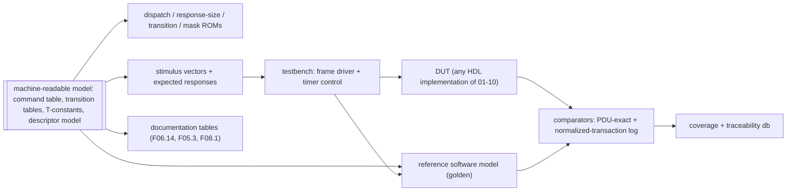
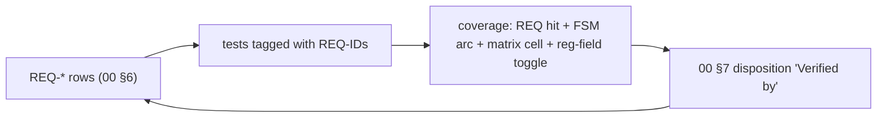

<!-- SPDX-License-Identifier: CERN-OHL-W-2.0 -->
# 09 — Verification & Compliance Strategy

## 1. Environment

**F09.1 — Single-source model drives everything**

The reference model and the DUT consume identical stimulus; comparison happens at two
levels: **wire-exact** response octets (parser/builder correctness) and the
**normalized-transaction log** (semantic state evolution: bindings, registry, lock,
counters). This realizes the original document's single-source vision
([review §4](../00_MILAN_COMPLIANCE_REVIEW.md)).

## 2. Traceability

**F09.2 — Requirement ↔ test loop**

Rule: every matrix row's **Ver** category expands to ≥ 1 tagged test; a release run
reports uncovered REQ-IDs as failures.

## 3. Test categories

**F09.3 — Categories (the Ver column vocabulary of 00 §6)**

| Cat | Method | Coverage goal |
|---|---|---|
| **DIR** | directed per-command tests from generated vectors (valid + each error status) | every F06.14 row, every status code reachable |
| **MTXW** | **matrix walker**: drive every cell of [F05.3](05_acmp_engine.md#fig-05-listener-matrix) (state × event, incl. `—`/`ign` cells proven inert), both ADP SMs, the SRP FSMs ([F10.2–F10.5](10_srp_engine.md), incl. the Δ13 registrar rule), and the MAAP Table B.7 matrix ([11 §6](11_maap_engine.md), incl. both compare_MAC tie-breaks and the `-x-` ignores) | 100 % cells + FSM arcs |
| **TOL** | malformed/tolerance suite ([F09.4](#fig-09-malformed)) | every V-rule of [F03.6](03_packet_engine.md#fig-03-valrules) |
| **TIM** | compressed-timer runs (prescaler factor) over every [F08.1](08_timing.md#fig-08-constants) row: advertise cadence, probe attempts + backoff, settle timeout, controller monitors, lock auto-unlock, TIME_LIMITED expiry, DA freshness; plus response-budget assertions (`T-BUDGET-*`) | every F08.1 row exercised + budget histograms |
| **RND** | randomized multi-controller sessions (16+ controllers: register/deregister churn, concurrent SETs, lock contention, GDI batches) against the reference model | scoreboard classes interleaved; no divergence |
| **STORM** | notification stress: counter churn at rate limit, fan-out to full registry, TX-arbiter starvation probes | pacing + ≤1/desc/s verified; no solicited deadline miss |
| **NVM** | power-cut/restore: cut at randomized commit points, verify CRC fallback + restored bindings enter `PRB_W_AVAIL`; persisted-set completeness per REQ-PER-001 | every record type cut ≥ once |

**F09.4 — Malformed/tolerance list (TOL)**

| Case | Expected |
|---|---|
| 2013 96-B ACMPDU and 56-B Milan ACMPDU | both accepted (V3) |
| REGISTER_UNSOLICITED without `flags` (cdl 12) | accepted as flags = 0 (V4) |
| padded minimum-size frames, cdl < frame length | parsed by cdl (V2) |
| cdl + 12 > frame length | dropped + counted (V1) |
| AECP command for a foreign target, including exact 38 through 45 B frames | silently dropped before short-command response dispatch (V6) |
| h ≠ 0 / version ≠ 0 / unknown subtype | dropped (V8) |
| unknown AEM opcode (each reserved range sampled) | echo + `NOT_IMPLEMENTED`, correctly sized |
| MVU wrong protocol_id / unknown MVU type | VU `NOT_IMPLEMENTED` echo |
| GET_DYNAMIC_INFO with a **non-§7.4.76.2** command inside (variable-size GET or non-GET) | `BAD_ARGUMENTS`, nothing processed |
| GET_DYNAMIC_INFO batching **all 13** §7.4.76.2 commands | accepted; unimplemented members answered per-element `NOT_SUPPORTED`, implemented ones with data |
| GET_DYNAMIC_INFO batch overflowing 524 cdl | overflowing elements skipped, rest answered |
| oversize READ_DESCRIPTOR response path | > 524-cdl frame emitted correctly (Δ8) |
| ACMP responses with mismatched {controller, seq} | silently ignored |
| IDENTIFY_NOTIFICATION received as a command | `BAD_ARGUMENTS`, correctly sized (IEEE §7.4.39.2) |
| duplicate BIND_RX (same seq) replay | idempotent / cached response |
| MRPDU with a malformed vector attribute mid-PDU | prefix processed; rest of that list + subsequent messages discarded (V9, Milan §4.2.7.1.2) |
| deadline expiry mid-command (TIM, compressed timers) | forced FAIL_SAFE response emitted — never a silent retire (03 §6 rule (e)) |

## 4. Reference-model contract

- Interfaces mirror [02](02_interfaces.md): frame in/out, class-B/C/D adapter stubs
  with scriptable state (SRP attribute injection, GM changes, media-lock events),
  virtual NVM, virtual time.
- Log format: one line per normalized transaction
  {origin, protocol, opcode, key, status, state-delta hash} — diffable against the DUT
  trace port ([02 §7](02_interfaces.md)).
- The model is the arbiter for RND; wire-exact comparison is authoritative for DIR/TOL.

## 5. Conformance alignment

Milan v1.2 has **no PICS annex**; certification runs against Avnu's separate test
plans. The 00 §6 matrix is this project's conformance statement; categories DIR/TIM/TOL
are designed so an Avnu-style external tester (e.g. probing advertise cadence, binding
recovery, GET_MILAN_INFO) passes as a byproduct. Interop smoke set: enumerate + bind
against at least two independent controller implementations.

## 6. Coverage targets

| Metric | Target |
|---|---|
| F05.3 matrix cells (incl. inert proofs) | 100 % |
| FSM states/arcs (F04.2, F04.3, F05.4/5, F06.5, F06.8, F03.3) | 100 % |
| F06.14 rows × {success, each error} | 100 % |
| PDU reg-figure field toggle (parser + builder) | 100 % of defined fields |
| REQ-ID tags | 100 % (release gate) |
| Budget histograms | max ≤ T-BUDGET-* under worst-case stimulus |

## 7. Documentation-sync regression

`make check` is the CI gate, and runs today:

| Target | Script | Asserts |
|---|---|---|
| `lint` | `scripts/lint-diagrams.sh` | every embedded mermaid block renders (`mmdc`); every wavedrom block is strict JSON |
| `links` | `scripts/check-links.py` | every relative link resolves; every `#anchor` exists in its target (code-block examples excluded) |
| `wavedrom-check` | `scripts/render-wavedrom.py --check` | every committed WaveDrom SVG matches the fenced source it was rendered from |
| `matrix` | `scripts/check-matrix.py` | REQ-IDs unique and fully populated; `Ver` values ∈ the §3 vocabulary; every GAP defined ↔ dispositioned |
| `modmatrix` | `scripts/gen_matrix.py --check` | `docs/traceability/MODULE_MATRIX.md` is not stale, and no module is without a suite (budget zero) |
| `stale` | `Makefile` | each committed `.svg` is newer than its `.drawio` source |

## 8. The suites that exist today

The single-source generated environment of [F09.1](#fig-09-env) is still the target
shape. What the tree actually carries is one hand-written, self-checking Verilator suite
per module under `tb/`, each with an **independent** C++ reference model built from the
document byte offsets — never from DUT logic.

| Command | Runs |
|---|---|
| `./scripts/run_suites.sh` | every suite under `tb/`, globbed rather than listed; exit code = number of failing suites, and exit 90 if a passing suite's tally line cannot be read |
| `cd tb/<suite> && make` | one suite; exit 0 = PASS |
| `./scripts/lint_hdl.sh` | Verilator `--lint-only` over every module elaborated as a top, zero warnings tolerated |

Do not quote a check total here — run `./scripts/run_suites.sh` and read the summary line.
Each `tb/<suite>/README.md` states what its suite proves, its recorded limits, and where
one exists a **mutation record**: deliberate breakages and how many checks each turned
red. That table is the evidence a suite has teeth.

Neither `run_suites.sh` nor `lint_hdl.sh` is wired into `make check`, which is the
documentation gate only; they are run separately before a submodule pin moves. See the
[HDL engineer guide](../guides/hdl-engineer.md#6-running-the-testbenches).

### 8.1 Dynamic-state overlay: the per-field A/B evidence map (issue #72)

Every controller-settable field is graded on both arms -- A: unwritten reads the
descriptor-image default; B: written reads the overlay -- plus row isolation and
fail-closed addressing. The checks live in `tb/pp_top/sim_main.cpp` (W-sections)
and `tb/dyn_state/sim_main.cpp` (lettered sections):

| Field | A: image fallback | B: written overlay | Isolation / fail-closed |
|---|---|---|---|
| current_configuration | W3c, W3d, W16a | W18/W18b/W18c/W18c3; W22a (SUCCESS-arm reachability after W21u's unbind) + W22d (residue displacement) | mechanism-level: dyn_state C, D (row addressing shared across selectors) |
| sampling_rate | W5 (byte-exact image 96000); W9i (a rate the AUDIO_UNIT list does not hold is refused on the unset row carrying the image's 96000, GET still reads it) | W9/W9b/W9c (48000, GET and the GET_DYNAMIC_INFO member); the list check (issue #51) on a set row: W9j (refusal carries the stored rate), W9k (refusals of an unlisted, a pulled and a zero rate write, mark and notify nothing, graded at the effect strobes and a second registered controller; the accepted listed rate moves each once), W9l (count, entries and offset are the image's, patched in place), W9m (the lock outranks the list check) | mechanism-level: dyn_state C, D |
| clock_source | W6/W6b; W10i (a refusal on the unset row carries the image's index, GET still reads it) | W10/W10d; the accepted SET answers the index it stored, not the one it replaced, on the unset row (W10j7b, 0 to 1) and on a set row (W10b, 1 to 2); refusals write nothing: W10e-W10h; refusals mark and notify nothing, graded at the effect strobes and a second registered controller: W10j | mechanism-level: dyn_state C, D |
| stream formats (in/out) | W4 per type and index | W23a/W23a2 (SET, both the echo and the published row), W23b (GET_STREAM_FORMAT serves the setting through the fold), W23i (the output row); refusals write nothing: W23c-W23h, W25a | dyn_state C, D + the per-row face checks F |
| presentation offset | (no getter opcode; live face + GET_STREAM_INFO word 3) | W24a/W24a2 (SET + the published row), W24b (GET_STREAM_INFO serves it through the fold), W25d; refusals write nothing: W24c-W24h, W25b | dyn_state C + the per-row face checks F |
| Identify control | W12/W12b/W12c (pre-SET GET) | W12d-W12h (SET/GET cycles), W13-W13d (step legality); volatility: dyn_state E | dyn_state E |
| started/stopped | NOT in this store: the ACMP binding record owns it and selector 6 is RETIRED (dyn_state F2) | listener suite + pp_top W21 | dyn_state F2 |

Reset and persistence semantics: dyn_state A (everything invalid out of reset)
and E (dirty marks the persisted set, and only it). The store is flops by
design -- the fields are read continuously by the fabric -- with the area taken
in per-field widths; the module banner carries the numbers.

To add once the generated environment exists: REQ-ID ↔ test-tag coverage (§2), and a
single-source scan (no timing values outside F08.1, no parameter values outside F01.5)
per the scope rules in [docs/README §2](../README.md).
