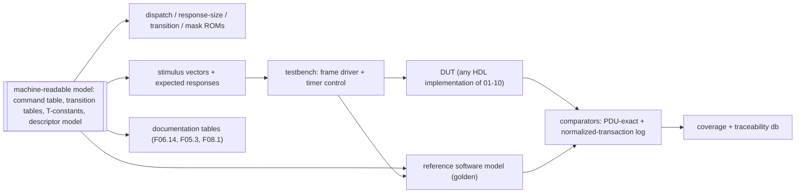
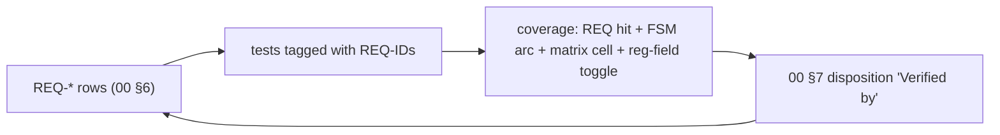

<!-- SPDX-License-Identifier: CERN-OHL-W-2.0 -->
# 09 — Verification & Compliance Strategy

## 1. Environment

**F09.1 — Single-source model drives everything**

The reference model and the DUT consume identical stimulus; comparison happens at two
levels: **wire-exact** response octets (parser/builder correctness) and the
**normalized-transaction log** (semantic state evolution: bindings, registry, lock,
counters). This realizes the original document's single-source vision
([review §4](../00_MILAN_COMPLIANCE_REVIEW.md)).

## 2. Traceability

**F09.2 — Requirement ↔ test loop**

Rule: every matrix row's **Ver** category expands to ≥ 1 tagged test; a release run
reports uncovered REQ-IDs as failures.

## 3. Test categories

**F09.3 — Categories (the Ver column vocabulary of 00 §6)**

| Cat | Method | Coverage goal |
|---|---|---|
| **DIR** | directed per-command tests from generated vectors (valid + each error status) | every F06.14 row, every status code reachable |
| **MTXW** | **matrix walker**: drive every cell of [F05.3](05_acmp_engine.md#fig-05-listener-matrix) (state × event, incl. `—`/`ign` cells proven inert), both ADP SMs, the SRP FSMs ([F10.2–F10.5](10_srp_engine.md), incl. the Δ13 registrar rule), and the MAAP Table B.7 matrix ([11 §6](11_maap_engine.md), incl. both compare_MAC tie-breaks and the `-x-` ignores) | 100 % cells + FSM arcs |
| **TOL** | malformed/tolerance suite ([F09.4](#fig-09-malformed)) | every V-rule of [F03.6](03_packet_engine.md#fig-03-valrules) |
| **TIM** | compressed-timer runs (prescaler factor) over every [F08.1](08_timing.md#fig-08-constants) row this processor implements (`T-CTR-OBSERVE` is integrator-owned): advertise cadence, probe attempts + backoff, settle timeout, controller monitors, lock auto-unlock, TIME_LIMITED expiry, DA freshness; plus response-budget assertions (`T-BUDGET-*`) | every F08.1 row with RTL here exercised + budget histograms |
| **RND** | randomized multi-controller sessions (16+ controllers: register/deregister churn, concurrent SETs, lock contention, GDI batches) against the reference model | scoreboard classes interleaved; no divergence |
| **STORM** | notification stress: counter churn at rate limit, fan-out to full registry, TX-arbiter starvation probes | pacing + ≤1/desc/s verified; no solicited deadline miss |
| **NVM** | power-cut/restore: cut at randomized commit points, verify CRC fallback + restored bindings enter `PRB_W_AVAIL`; persisted-set completeness per REQ-PER-001. For every persisted group: the stores read cleared (value and valid flag) before any restore applies; a real command saves and a real command reads back after reset; deleting the group's live trigger, or its replay, each fails a named check; a completion mark is never the oracle; volatile state (IDENTIFY, lock, registry) is populated before the cycle and absent after it; transport faults (DEVICE, torn, deadline) are kept distinct from value refusals; descriptor-memory debt and roll-back faults end DEFAULTS or CLOSED (§8.2) | every record type cut ≥ once; every group's trigger and replay mutation killed |

**F09.4 — Malformed/tolerance list (TOL)**

| Case | Expected |
|---|---|
| 96-B IEEE 1722.1-2021 ACMPDU (cdl 84) and 56-B Milan ACMPDU (cdl 44, the IEEE 1722.1-2013 length) | both accepted (V3) |
| REGISTER_UNSOLICITED without `flags` (cdl 12) | accepted as flags = 0 (V4) |
| padded minimum-size frames, cdl < frame length | parsed by cdl (V2) |
| cdl + 12 > frame length | dropped + counted (V1) |
| AECP command for a foreign target, including exact 38 through 45 B frames | silently dropped before short-command response dispatch (V6) |
| h ≠ 0 / version ≠ 0 / unknown subtype | dropped (V8) |
| unknown AEM opcode (each reserved range sampled) | echo + `NOT_IMPLEMENTED`, correctly sized |
| MVU wrong protocol_id / unknown MVU type | VU `NOT_IMPLEMENTED` echo |
| GET_DYNAMIC_INFO with a **non-§7.4.76.2** command inside (variable-size GET or non-GET) | `BAD_ARGUMENTS`, nothing processed |
| GET_DYNAMIC_INFO batching **all 13** §7.4.76.2 commands | accepted; unimplemented members answered per-element `NOT_SUPPORTED`, implemented ones with data |
| GET_DYNAMIC_INFO batch overflowing 524 cdl | overflowing elements skipped, rest answered |
| oversize READ_DESCRIPTOR response path | > 524-cdl frame emitted correctly (Δ8): byte-exact, through TX slot 4 above a 576-byte frame and freed after (tb/pp_top AX OV) |
| GET_AUDIO_MAP page above 62 records | served whole up to 71 (above cdl 524, the oversize slot from 66); above 71 `NO_RESOURCES`, `number_of_mappings` 0 (tb/pp_top AX PG) |
| ACMP responses with mismatched {controller, seq} | silently ignored |
| IDENTIFY_NOTIFICATION received as a command | `BAD_ARGUMENTS`, correctly sized (IEEE §7.4.39.2) |
| duplicate BIND_RX (same seq) replay | idempotent / cached response |
| MRPDU with a malformed vector attribute mid-PDU | prefix processed; rest of that list + subsequent messages discarded (V9, Milan §4.2.7.1.2) |
| deadline expiry mid-command (TIM, compressed timers) | forced FAIL_SAFE response emitted — never a silent retire (03 §6 rule (e)); `tb/pp_top` DL1 to DL6 ([§8.3](#83-the-aecp-deadline-and-the-hazard-classes-issues-81-57-84)) |

## 4. Reference-model contract

- Interfaces mirror [02](02_interfaces.md): frame in/out, class-B/C/D adapter stubs
  with scriptable state (SRP attribute injection, GM changes, media-lock events),
  virtual NVM, virtual time.
- Log format: one line per normalized transaction
  {origin, protocol, opcode, key, status, state-delta hash} — diffable against the DUT
  trace port ([02 §7](02_interfaces.md)).
- The model is the arbiter for RND; wire-exact comparison is authoritative for DIR/TOL.

## 5. Conformance alignment

Milan v1.2 has **no PICS annex**; certification runs against Avnu's separate test
plans. The 00 §6 matrix is this project's conformance statement; categories DIR/TIM/TOL
are designed so an Avnu-style external tester (e.g. probing advertise cadence, binding
recovery, GET_MILAN_INFO) passes as a byproduct. Interop smoke set: enumerate + bind
against at least two independent controller implementations.

## 6. Coverage targets

| Metric | Target |
|---|---|
| F05.3 matrix cells (incl. inert proofs) | 100 % |
| FSM states/arcs (F04.2, F04.3, F05.4/5, F06.5, F06.8, F03.3) | 100 % |
| F06.14 rows × {success, each error} | 100 % |
| PDU reg-figure field toggle (parser + builder) | 100 % of defined fields |
| REQ-ID tags | 100 % (release gate) |
| Budget histograms | max ≤ T-BUDGET-* under worst-case stimulus |

## 7. Documentation-sync regression

`make check` is the documentation gate, and the CI `docs-gates` job
([`hdl.yml`](../../.github/workflows/hdl.yml)) runs exactly that target, with the
`wavedrom` package and Mermaid CLI 11.16.0 installed first. It runs today:

| Target | Script | Asserts |
|---|---|---|
| `lint` | `scripts/lint-diagrams.sh` | every embedded mermaid block renders (`mmdc`); every wavedrom block is strict JSON |
| `links` | `scripts/check-links.py` | every relative link resolves; every `#anchor` exists in its target (code-block examples excluded) |
| `wavedrom-check` | `scripts/render-wavedrom.py --check` | every committed WaveDrom SVG matches the fenced source it was rendered from |
| `matrix` | `scripts/check-matrix.py` | REQ-IDs unique and fully populated; `Ver` values ∈ the §3 vocabulary; every GAP defined ↔ dispositioned |
| `modmatrix` | `scripts/gen_matrix.py --check` | `docs/traceability/MODULE_MATRIX.md` is not stale, and no module is without a suite (budget zero) |
| `params` | `scripts/check-integrator-params.py` | the guide section 2 table and diagram 21's `integration-parameters` group each equal the overridable parameter set of `protocol_processor_top`, with no missing, extra or duplicate names; empty or unparseable inputs fail |
| `ids` | `scripts/check-ids.py` (`--selftest` first) | every `P-` or `T-` ID used in a file under `docs/`, `hdl/` or `tb/` has its row in [F01.5](01_overview.md#fig-01-params) or [F08.1](08_timing.md#fig-08-constants); a family (`T-MRP-*`) needs one row in it, each member of a braced list (`T-NVM-{RS-DEADLINE, RS-AGGREGATE}`) its own row, and an ID with an optional segment (`T-ADP-DELAY(-START)`) a row for both; braces or `(-` holding anything but ID segments fail; an ID broken at a line end and a sibling written as its last segment (`T-BUDGET-AECP-TYP / -WC`) are read whole, and `-1` reads as minus one only if the base has a row; any other text after a hyphen is prose (`T-MRP-JOIN-driven` uses `T-MRP-JOIN`); an unreadable, empty or duplicated master table fails. The self-test plants a stray in each scanned tree, a stray in each of those forms (including a missing minus-one base, a line-broken optional member and an optional member after a line-broken ID) and each master-table fault, and must see each caught with rc 1 and its diagnostic token |
| `figures` | `scripts/check-figures.py` (`--selftest` first) | every file under `docs/diagrams/` is a draw.io source with its export, a WaveDrom render whose block exists, or a hand-authored SVG listed in `docs/diagrams/README.md` that is well-formed, has an SVG-namespace `<svg>` root and a `viewBox`, carries no `<image>`, `<feImage>` or `<foreignObject>`, and is linked from a page ([docs/README §3](../README.md#3-figures-one-source-one-home)); any other file fails, and so does a missing or empty hand-authored inventory. The self-test plants each fault and must see it caught |
| `stale` | `Makefile` | each committed `.svg` is newer than its `.drawio` source |

## 8. The suites that exist today

The single-source generated environment of [F09.1](#fig-09-env) is still the target
shape. What the tree actually carries is one hand-written, self-checking Verilator suite
per module under `tb/`, each with an **independent** C++ reference model built from the
document byte offsets — never from DUT logic.

| Command | Runs |
|---|---|
| `./scripts/run_suites.sh` | every suite under `tb/`, globbed rather than listed; exit code = number of failing suites, and exit 90 if a passing suite's tally line cannot be read |
| `cd tb/<suite> && make` | one suite; exit 0 = PASS |
| `./scripts/lint_hdl.sh` | Verilator `--lint-only` over every module elaborated as a top, zero warnings tolerated |

Do not quote a check total here — run `./scripts/run_suites.sh` and read the summary line.

Two suites are MTXW walks in the sense of [§3](#3-test-categories), each from an
independent transcription of the specification's table and ending in a cell count:
`tb/acmp_listener` walks F05.3, and `tb/adp_engine` walks F04.2 (Milan Table 5.51,
with the §5.6.1 boot gate and both hardware phases of DELAY) and F04.3 (Milan
Table 5.54 and its §5.6.4.5 guards), each cell citing its Milan clause and the IEEE
1722.1-2021 clause it replaces or follows as [04 F04.7](04_adp_engine.md#fig-04-advcells)
and [F04.8](04_adp_engine.md#fig-04-discarcs) derive them. Their READMEs carry the tables.
Each `tb/<suite>/README.md` states what its suite proves, its recorded limits, and where
one exists a **mutation record**: deliberate breakages and how many checks each turned
red. That table is the evidence a suite has teeth.

Neither `run_suites.sh` nor `lint_hdl.sh` is wired into `make check`, which is the
documentation gate only; they are run separately before a submodule pin moves. See the
[HDL engineer guide](../guides/hdl-engineer.md#6-running-the-testbenches).

Of the single-source rules of [docs/README §2](../README.md#2-identifier-registries),
`make check` enforces the ID half and nothing more: `ids` (§7) fails any `P-` or `T-` ID
under `docs/`, `hdl/` or `tb/` without its F01.5 or F08.1 row, and `params` holds the
integrator guide's parameter inventory to the top. No gate reads values; the value scan
is the single-source scan still to add at the end of this section.

### 8.1 Dynamic-state overlay: the per-field A/B evidence map (issue #72)

Every controller-settable field is graded on both arms -- A: unwritten reads the
descriptor-image default; B: written reads the overlay -- plus row isolation and
fail-closed addressing. The checks live in `tb/pp_top/sim_main.cpp` (W-sections)
and `tb/dyn_state/sim_main.cpp` (lettered sections):

| Field | A: image fallback | B: written overlay | Isolation / fail-closed |
|---|---|---|---|
| current_configuration | W3c, W3d, W16a; AD1/AD1b (the ADPDU carries the image default while the row is unset); AD6 (a restore that applied the row and rolled back advertises the image default); AD7 (a reset after a SUCCESS SET_CONFIGURATION, with nothing to restore, advertises the image default); AD8, AD9 (a corrupt record 0x00 and a torn read of it keep the image default, issue #63) | W18/W18b/W18c/W18c3; W22a (SUCCESS-arm reachability after W21u's unbind) + W22d (residue displacement); AD2-AD4 (the next ADPDU carries the written overlay, only wire bytes 64..65 and available_index move); AD5 (a configuration the D3 writer saved and restored is advertised from the first ADPDU, and GET agrees) | mechanism-level: dyn_state C, D (row addressing shared across selectors) |
| sampling_rate | W5 (byte-exact image 96000); W9i (a rate the AUDIO_UNIT list does not hold is refused on the unset row carrying the image's 96000, GET still reads it) | W9/W9b/W9c (48000, GET and the GET_DYNAMIC_INFO member); the list check (issue #51) on a set row: W9j (refusal carries the stored rate), W9k (refusals of an unlisted, a pulled and a zero rate write, mark and notify nothing, graded at the effect strobes and a second registered controller; the accepted listed rate moves each once), W9l (count, entries and offset are the image's, patched in place), W9m (the lock outranks the list check) | mechanism-level: dyn_state C, D |
| clock_source | W6/W6b; W10i (a refusal on the unset row carries the image's index, GET still reads it) | W10/W10d; the accepted SET answers the index it stored, not the one it replaced, on the unset row (W10j7b, 0 to 1) and on a set row (W10b, 1 to 2); refusals write nothing: W10e-W10h; refusals mark and notify nothing, graded at the effect strobes and a second registered controller: W10j | mechanism-level: dyn_state C, D; a CLOCK_DOMAIN the image lacks is NO_SUCH_DESCRIPTOR with a zero body, moving nothing, and the lock still outranks the miss: `tb/pp_top` AX NSD1-NSD3 (issue #37) |
| stream formats (in/out) | W4 per type and index | W23a/W23a2 (SET, both the echo and the published row), W23b (GET_STREAM_FORMAT serves the setting through the fold), W23i (the output row); refusals write nothing: W23c-W23h, W25a | dyn_state C, D + the per-row face checks F |
| presentation offset | (no getter opcode; live face + GET_STREAM_INFO word 3) | W24a/W24a2 (SET + the published row), W24b (GET_STREAM_INFO serves it through the fold), W25d; refusals write nothing: W24c-W24h, W25b | dyn_state C + the per-row face checks F |
| Identify control | W12/W12b/W12c (pre-SET GET) | W12d-W12h (SET/GET cycles), W13-W13d (step legality); AX LK3b/LK3c (the out-of-range refusal carries the 255 in force, IEEE §7.4.25.1); volatility: dyn_state E | dyn_state E |
| started/stopped | NOT in this store: the ACMP binding record owns it and selector 6 is RETIRED (dyn_state F2) | listener suite + pp_top W21 | dyn_state F2 |

Reset and persistence semantics: dyn_state A (everything invalid out of reset),
E (the diagnostic dirty marks the persisted set, and only it) and H (the change
qualifier that triggers the D3 writer: an accepted write that changes the row's
`{value, valid}` projection, never IDENTIFY). The store is flops by design -- the
fields are read continuously by the fabric -- with the area taken in per-field
widths; the module banner carries the numbers.

### 8.2 Saved state: the scalar and name stages' evidence (issues #131, #61, #83)

The parent D3 contract's processor lanes 1 (scalars) and 3 (names) graded at the top, on real AECP commands over
the device model (`tb/pp_top` section D3, focused with `--d3-only`), and on the binding
manager (`tb/acmp_nvm`):

| Property | Checks |
|---|---|
| cleared first: every scalar row at its reset value, valid clear, when the D3 walk starts | D3R1 |
| real-command save, power cycle and readback of every group, value and valid flag | D3S1 (first and last index of each group), D3R1 (GET of each) |
| six trigger and six replay deletions, one per scalar group (`TRG_*`, `RPL_*`) | each fails its own D3S1 or D3R1 check (driver `tb/pp_top/d3_mutants.py`, mutation record in `tb/pp_top/README.md`) |
| taint, change-wins-done, clear by group AND index, coalescing, DR2b unchanged projection | D3S3, D3S4, D3S5, D3S6, D3S8 |
| restore writes are no changes; IDENTIFY is no change | D3R1, D3S7 |
| volatile exclusions after the saved-set cycle (IDENTIFY, lock, registry) | D3R1 |
| the volatile set across a power cycle that restores a saved binding (issues #59, #62): two registrations, one TIME_LIMITED, the lock and IDENTIFY 255 before it; after it the binding is back, IDENTIFY reads 0 and the lock is clear in every cycle from `restore_go_i`, a third controller's change notifies neither former controller, nothing reaches them for 66 s (no CONTROLLER_AVAILABLE, no expiry DEREGISTER), a second controller's LOCK_ENTITY is accepted, sixteen new controllers register, and a returning controller restarts at sequence_id 0; the registry's valid bits, the lock and IDENTIFY each deleted from their reset branch fail it | D3V1 to D3V9 (`--volatile-only`) |
| the user names (issues #61, #83; Milan §5.3.13): a real SET_NAME of both ENTITY names (the group name a full 64 bytes), an EMPTY name, the IDENTIFY CONTROL's name and the last ordinal each saved as one record `0x80`+ordinal, byte-exact; an unchanged name saves nothing; across a power cycle the entries hold the image's names at the image proof, the five come back (GET_NAME and READ_DESCRIPTOR), no restore write pulses `aecp_name_wr_o` or becomes a change; an ordinal past the image's names refused by the rule, a corrupt and a short record by the frame; a pass-1 roll-back returns the image's names; a change during the WRITE taints it; an image loaded late is walked before the names are written back | D3N1 to D3N7 |
| every D3 record type (configuration, rate, clock source, both formats, offset, name) cut by a real `rst_n` with the device carried, mid-commit at fixed points (the ERASE's grant, the WRITE's grant, after the header, one byte short) and at one drawn from a fixed seed: the restore never fails, a cut before the ERASE completed keeps the saved value, an erased or torn record keeps the image's value (blank, or the crc's refusal), a saved binding is restored and probes PASSIVE, and a later SET persists | D3K |
| every record type both producers write (the D3 writer's seven and the binding manager's sink record) cut by a real `rst_n` at seeded-random commit points, a standing campaign of 32 seeds per type (issue #83 and the manager's ruling on it): rst_n falls a seeded number of clocks after the record's ERASE is granted, anywhere up to two clocks past its WRITE's done (a calibration commit measures the span); the outcome is read from what the device holds at the cut, never the RTL: A whole or B whole comes back, and any other bytes frame no record and keep the default (the image's value, an unbound sink); the restore never fails, a restored binding probes PASSIVE, a later change persists; every check names its seed (`--cut-seed S` reruns one) | D3KR (`--cuts-only`, and the default run) |
| a record that cannot be restored keeps the image's value (issues #52, #63): the clock source erased, corrupt or read torn, and the configuration corrupt or read torn (erased: AD7), each graded through GET and the published value; the saved clock-source index is exported in every cycle the ADP enable is high | D3C5, D3C6; AD8, AD9 |
| value refusals (frame, rule) kept apart from transport faults (DEVICE, torn, deadline, unframed) | D3R2, D3R3 against D3R5, D3R6, D3R8 |
| the rate rule's walk past the list's first lane to its eight-entry bound | D3R3b |
| pass agreement in both directions, descriptor-read error never a refusal, roll-back of both stores for at least two cycles | D3R4, D3R4b, D3R7 |
| every watched wait: a pass-1 read abandoned to the drain, a silent format judge, the per-wait deadline to the cycle | D3R5b, D3R8b, D3R8 |
| the ratified 1,000 ms aggregate from `restore_go_i`, derived from `CLK_HZ_P`, against a device just inside every per-wait deadline | D3R13 |
| an aggregate expiry never closes a provable image: a binding walk slowed per byte past the bound fails whole at it, and the D3 walk proves the image and ends DEFAULTS (CLOSED only with an unprovable image) | D3R14 |
| the aggregate spans the roll-back: a bound inside its debt wait or its re-LOCATE ends it CLOSED on the bound's own clock | D3R15 |
| the aggregate is inert after COMPLETE, DEFAULTS and CLOSED, and never fires with an event in hand: a grant on the bound's own clock is drained, and a later SET persists | D3R16, D3R17 |
| an abort presented in the arbiter's issue cycle arms the drain, for either manager: the binding walk's READ strobe on the aggregate's first clock is drained, the port comes idle and a later SET persists | D3R18; `tb/acmp_nvm` N10 |
| the arbiter's own contract for inputs neither in-tree manager presents, manager 1's half of each rule: its WRITE presented with an abort is never drained and completes; its abort drains none of manager 0's READs, in their issue cycle or while manager 0 owns them; after its WRITE, its READ abandoned in the issue cycle is still drained. The manager-0 halves stay ungraded by construction (the real binding manager aborts only its own READ; the `tb/acmp_nvm` README lists the five and the out-of-tree probes) | `tb/acmp_nvm` N11a; N11b (issue cycle) and N11d (owned); N11c |
| the aggregate's pre-proof variants: an image loaded late and proven by the writer's LOCATE after the bound, a bound inside that LOCATE, a proof on the bound's own clock in `W_IMG` and in `W_IMGLOC`, all DEFAULTS with no record READ; a binding byte in hand on the expiry clock, and the walk fails whole at its next waiting clock | D3R19, D3R20, D3R21 |
| the AECP hold admission: one AECP record in the ingress while held, the rest dropped and counted, ACMP at its idle latency; a record the optional external drain returns frees the share | D3O5, D3O6, D3O7; `tb/rx_validator` F28 |
| guard debt held across the roll-back, watchdog recovery, CLOSED on an unprovable image | D3R10, D3R12, D3O2, D3O3, D3O4 |
| completed bindings kept on a D3 roll-back | D3R11 |
| AECP held from reset; ADP released only by both walks | D3O1, D3R1, D3R9, D3S9, D3S11 |
| DR2c on both producers: three attempts, the top's derived backoff, dispatch free while it runs, no forgiveness | D3S10; `tb/acmp_nvm` E8 to E11 |
| the clock-source selection over a ten-source domain (issue #141; 07 §3.1 L6): SET_CLOCK_SOURCE of the last AAF index accepted, notified once and read back over GET, the row and the export; the count refused BAD_ARGUMENTS carrying the index in force, with nothing stored, marked, notified or saved; the AAF index saved and restored (the D3S1/D3R1 pair, REQ-AEM-013); the saved index refused on restore over an image whose count it equals or exceeds | D3C1, D3C2, D3C3, D3C4 |

Every negative control above runs from the tree: `tb/pp_top/d3_mutants.py` plants 110
of them, each in its own extract, and requires its named checks to fail (all 110 KILLED
at the head of lane P1; mutation records in the `tb/pp_top`, `tb/acmp_nvm` and
`tb/rx_validator` READMEs). The two SET_CLOCK_SOURCE range-check controls of D3C1 and
D3C2 run from `tb/pp_top/aecp_dispatch_mutants.py` (its `d3` target). The name stage's controls (each trigger and replay, the rule, the empty name, the record id and entry, a partial write-back, the taint, a restore that pulses or changes, names before the image, the store left out of the roll-back, the frame's crc) run from `d3_mutants.py` too, and so do the cut campaign's two (a torn binding record, and a torn D3 record, restored because the crc is no longer compared). The channel maps are the integrator's to persist (07 §5.1), so their controls are the integrator's. The top-level
device model misbehaves on the handshake for the walks (late grant, silent header, late
or erroring descriptor memory), which grades the walks' deadlines; the port's own
deadline, resets and handshake models are §8.6's.

### 8.3 The AECP deadline and the hazard classes (issues #81, #57, #84)

The deadline engine of [03 §6](03_packet_engine.md) rule (e) and
[08 §4](08_timing.md#4-deadline-budgets), and its budgets, graded in the compressed timebase of
`tb/pp_top` section DL (`--deadline-only`, 1 ms = 100 clocks, so the armed
deadline is 10,000 clocks and `T-AECP-RESP` 24,000) and at the µCPU in
`tb/ucpu` P20. Every stall is an integrator face answering slowly but inside
its watchdog.

| Property | Checks |
|---|---|
| a command stalled past its budget is answered by a well-formed forced response (ENTITY_MISBEHAVING, header only, byte-exact) inside `T-AECP-RESP`, never a silent retire; the kill rises at the deadline; the program stops at an op boundary | DL1 |
| the key stays held from the expiry to the forced response's hand-off to its lane and is released in that clock, once | DL1 |
| a program past its first effect is not preempted: its own response, every effect once, the state reads back | DL2; `tb/ucpu` P20c |
| the deadline counts from reception, queue wait included; a Milan Vendor Unique command answers NOT_IMPLEMENTED with the command echoed | DL3 |
| a GET_DYNAMIC_INFO past its deadline runs no further record and is voided | DL4 |
| a frame owed no response retires through the normal release | DL5 |
| an edit riding the edit face is never preempted | DL6 |
| neither are the registry and lock commands, whose first op commits on the registry face: a REGISTER_UNSOLICITED_NOTIFICATION and a LOCK_ENTITY queued past their deadline answer their own SUCCESS, never redirected, and the registration and the lock take effect | DL10 |
| an honoured kill ends the AECP owner: the RX-slot return after it releases nothing, and across the section every normal release names a live hold | DL1, DL11 |
| nothing leaks: every RX slot free, the next command byte-exact | DL7 |
| every message type but AEM's, past its deadline: an ADDRESS_ACCESS, an AVC, an HDCP_APM and an EXTENDED command queued behind a stall answer NOT_IMPLEMENTED with the command echoed, as idle, never status 10 (IEEE Table 9-2) | DL9 |
| REQ-MVU-005 on the fault path: an MVU response whose memory fails (a read error, a write error, a tied-off master, and a command padded to 540 payload bytes, whose 578-byte echo needs the oversize slot) answers NOT_IMPLEMENTED with the command echoed, as the deadline's does, and is counted; an AEM one still answers ENTITY_MISBEHAVING | DL8 |
| the one command held through the boot restore is exempt (rule (d)) | D3O6 |
| the redirect: before the first op, never after an effect, never cutting a waiting op, once per dispatch, dropping a partly built body, keeping a batch's cursor, the best current status kept | `tb/ucpu` P20a to P20h |
| T-AECP-RESP for MVU (REQ-MVU-005): GET_MILAN_INFO and an unimplemented MVU command, byte-exact, at the suite's memory latency and at the reference 143 clocks, graded against their lines at `P-CLK-HZ` | TB1 |
| the 08 §4 worst-case stimuli: an oversize READ_DESCRIPTOR (byte-exact, the oversize TX slot) and a GET_DYNAMIC_INFO carrying all thirteen getters, at both latencies | TB2 |
| the engine busy: each of those behind a 15-frame notification fan-out, answered as idle, within one job plus its idle latency of the fan-out's last frame; GET_MILAN_INFO against a response memory stalled short of its watchdog | TB3, TB4 |
| `T-BUDGET-ACMP-RESP`: ACMP answers idle and beside that load, later than idle by at most one frame on the wire | TB5 |
| the deadline never fired while the budgets were measured | TB |
| `T-LOCK-UNLOCK` and `T-NOTIF-TIMELIMITED` at the top's own defaults, 60,000 and 300,000 ms, not the 400 ms override U5 and L6d run under: the auto-unlock notification and the expiry DEREGISTER reach the registered controller no sooner than the default after the command and at most 20 ms later, the registration kept alive meanwhile by answering the monitor's probes | TD1, TD2 |
| every transaction presents its F03.7 class and key: 33 AECP rows (all nine classes, the GETs' descriptor keys, the no-descriptor key of READ_DESCRIPTOR, GET_DYNAMIC_INFO (as `MAP_CFG`), MVU and of frames the engine drops) and 6 ACMP rows | HZ1 |
| CFG_BARRIER drains an in-flight ACMP step before executing and blocks a later ACMP head behind it | HZ2 |
| a pending barrier is never starved by the round-robin (the wedge the fix removes) | HZ3 |
| LOCK_OP waits for an ACMP stream step and runs beside an ACMP read | HZ4 |
| STREAM_CFG and RO_SNAPSHOT conflict per key; two reads run together; MAP_CFG waits for any stream step | HZ5 to HZ7 |
| CLOCK_CFG, NAME_WR, REGISTRY_OP, IDENTIFY and READ_DESCRIPTOR run beside an ACMP stream step; REGISTRY_OP, the one class with no reachable conflict, runs beside an ACMP read too; the one accepted over-serialization: a GET_DYNAMIC_INFO naming no stream waits for the step | HZ8 |
| NAME_WR and an ACMP read of the stream it names exclude each other, either one held, on both engines' keys: a SET_NAME on STREAM_INPUT 1 waits for a GET_RX_STATE of sink 1, then answers SUCCESS and the name reads back; it runs beside a read of another sink and beside an UNBIND_RX of the same one; held, a SET_NAME on STREAM_OUTPUT 1 holds back a GET_TX_STATE of source 1 and not one of source 2 | HZ9 |
| STREAM_CFG against an ACMP read of its key; on the talker's keys, STREAM_CFG against a GET_TX_STATE and a DISCONNECT_TX per key, and RO_SNAPSHOT against a DISCONNECT_TX, not against a read | HZ10 |
| CFG_BARRIER, LOCK_OP and the MAP_CFG cross-lock against the talker: the barrier holds back a read, the lock and a mapping edit hold back a step and not a read | HZ11 |
| CLOCK_CFG, IDENTIFY and MAP_CFG commands naming a stream descriptor conflict with an ACMP read of it, either one held, and are then refused NOT_SUPPORTED | HZ12 |
| a GET_DYNAMIC_INFO carrying a GET_STREAM_INFO record of STREAM_INPUT 1 waits for a held UNBIND_RX of sink 1, as the stand-alone getter does, holds one back when held itself, and runs beside a held GET_RX_STATE of sink 1 (R419-2 F5) | HZ13 |

Section TB runs in the suite's fifth build (`make budget`), whose timebase is the
nominal clock's own (1 ms = 1,000 clocks), so the deadline never cuts a measurement;
it prints the latency histogram ([08 §4](08_timing.md#4-deadline-budgets) records
it). Section TD runs in the sixth build (`make timer-defaults`), whose wrap keeps
the top's two timeouts, on the first build's timebase (1 ms = 100 clocks): it
waits out the real 300,000 ms, 30 million clocks.

Section HZ (`--hazards-only`) holds an ACMP transaction in flight by stalling the
MAC until four answers fill the standard TX slots, so the next ACMP command is
admitted and keeps its key until the MAC restarts; it grades every admission at
the scoreboard's port. The same stall holds an AECP command, whose response
waits for a standard slot. The talker returns its RX slot once it has read a
frame, so a talker transaction keeps its key a few clocks only, and a
talker-side pair is graded with the AECP command held. A check that a head
waits requires the scoreboard to have been asked about it and to have refused
it, and a MAAP allocator answers, so the talker is free to take commands. The negative controls run from `tb/pp_top/aecp_mutants.py`
(`make -C tb/pp_top aecp-mutants`): each is a reviewed patch in `tb/pp_top/mutations/` applied to a
scratch copy, and each must fail its named check. The mutation record is in
the [`tb/pp_top` README](../../tb/pp_top/README.md).

### 8.4 Notifications and identify: the RND and STORM evidence (issues #54, #58, #80, #86)

Each section runs on a fresh processor of its own in `tb/pp_top` (`--notify-only`,
`--spacing-only`, `--identify-only`, and the suite's third build for section ID), plus
one section of the originator's unit suite and four of the notification block's:

| Category | Section | What it proves |
|---|---|---|
| TIM | ID (third build, `P-EN-IDENTIFY-NOTIFICATION` = 1) | IDENTIFY_NOTIFICATION byte-exact to 91-E0-F0-01-00-01, three frames spaced `T-IDENT-BURST` from each previous frame's departure, identifySequenceID per burst, the `T-IDENT-REARM` re-arm while held, release, a release and press inside a burst, a held engine, a 15-row fan-out (also at frame 2's deadline), a MAC stall inside and between frames, on a frame's last byte and past the timeout, the command forms, and no press lost: a short and a long press in the gap after a burst, a press on the gap's last clock and either side of it, and a new press inside a burst let go before the gap ends, each a burst of its own when the gap ends |
| TIM | `tb/aecp_notify` FT (second build, `P-EN-IDENTIFY-NOTIFICATION` = 1) | the schedule's one-tick margins at the full timebase (the F01.5 default `P-CLK-HZ`; the pp_top bench's compressed tick cannot resolve them): a frame that leaves two clocks before a ms boundary is followed `T-IDENT-BURST` after that boundary, never a tick sooner; Figure 7-142's timeout counts from the boundary after the first frame left |
| DIR | ID0 (the default 0) | the button puts nothing on the wire |
| DIR | NP | every notifying command class pushes one byte-exact u = 1 response to a second registered controller, none to the requester, at the entry's own sequence_id |
| STORM | ST | one change fans out to all 16 rows byte-exact; GET_COUNTERS churned at 10 Hz on five descriptors emits at most once per descriptor per second; solicited AECP and ACMP answers stay inside `T-BUDGET-AECP-WC` / `T-BUDGET-ACMP-RESP` under the load |
| STORM | CS | ST's churn started at ST's phase and 30 and 95 clocks later (#148's shifted timing): every row's GET_COUNTERS rounds of each descriptor leave a second after its previous round's send, less the one tick the limiter reads, though a solicited answer delays a round's frames |
| RND | RN | a seeded REGISTER / DEREGISTER / LOCK / UNLOCK / SET / GET session from 20 controllers against an independent registry and lock model, zero divergence |
| RND | `tb/originator` R | a seeded session of 16 owners' overlapping CONTROLLER_AVAILABLE-shaped inflights, responses, expiries and cancellations in random order against an independent inflight model |
| DIR | `tb/aecp_notify` IX | the registry's identity index: a reused row refuses its previous controller, no identity one bit from a registered one matches, and in both cycles of a REGISTER's rewrite a command matching what `rows_r` holds still wins against a failed probe in the same cycle: in the row write's own cycle the reused row's previous controller, and, after a reset in that cycle, the row's identity, which the index then lacks |
| DIR | `tb/aecp_notify` TS | the counter throttle stamps' valid bit: a second change in the same second is held, and after a warm reset a change in that second goes out at once |
| DIR | `tb/aecp_notify` TW | a counter round that waits for the TX slot: the next round waits a second from the round's last send, never from its selection, and a change made while a job waits more than a second still waits a second after that send |

The mutation records are in the two suites' READMEs; `tb/pp_top/notify_mutants.py`
plants the pp_top controls.

### 8.5 The descriptor model lint (issues #38, #39, #60, #89)

The packer's self-test gate is `tb/desc_store/test_gen_desc_image.py`. `make` in
`tb/desc_store` runs it as `generator-check` before the RTL suite, so
`./scripts/run_suites.sh` and the `hdl` workflow gate it. It drives only `build()` and
the command line. The lint's negative cases are named mutations of the positive model
`milan_min.json`, in `tb/desc_store/lint_mutations.py`. The rules and their checks are
listed in [07 §3.1](07_memory_maps.md#model-lint).

| Property | Checks |
|---|---|
| the positive model packs with the lint on and reports `entity_model_id_i`, `talker_sources_i`, `listener_sinks_i`, `identify_index_i` and the recorded digest | `LintTest.test_milan_min_packs` |
| every check of `model_lint.CHECKS` has a mutation: one negative image per refusal | `LintTest.test_every_check_has_a_mutation` |
| each mutation is refused with its rule and check, on the arm its `detail` names where a check has several, and the same bytes pack with the lint off, so the refusal is the lint's and not a layout refusal (L1 to L12, 89 mutations; L9's 0 and all-ones, L8's index moving between two configurations, L11's two-configuration maximum, an ENTITY and a CONFIGURATION in configuration 1, each `descriptor-counts`, `stream-layout` (Table 7-8 and Annex C), `unique-mapping` and L2 arm, two INPUT_STREAM sources at a CRF input and one at each of two AAF inputs, an IDENTIFY outside the §7.3.5.2 format on each of its eight arms, a descriptor past its §7.2 extent or past 508 octets among them) | `LintTest.test_mutations` |
| the caps accept their own value (46 formats, 8 sampling rates, a 508-octet descriptor, 8 Annex C redundant streams), a CRF input's source beside one at an AAF input packs, each fixed-size Milan-subset type and AUDIO_MAP's `mappings_offset` are held to §7.2 (L12), and a field past a descriptor's end is the finding of the rule that needs it | `LintTest.test_boundaries_pack`, `LintTest.test_fixed_extents`, `LintTest.test_short_descriptor` |
| `example_milan_8.json` packs with the lint off, and is refused with it on (it is a layout vector, not a Milan model), though not for its Annex C streams | `LintTest.test_example_is_a_layout_vector`, `CommandLineTest.test_example_needs_no_lint` |
| standard-conforming models pack: a Unit's and its Port's CONTROLs in §7.2's walk order, the CONTROL of a JACK, an AVB_INTERFACE, a CONTROL_BLOCK, a PTP_INSTANCE or a Unit's External Port and a Unit's SIGNAL_SELECTOR left out of the top-level counts, an IDENTIFY whose value type carries the r or the u flag, Stream Port cluster ranges in either order, a second AVB_INTERFACE that configuration 1 omits or that first appears in configuration 1, every stream in the Milan Annex C Table C.1 layout (R = 0), a redundant pair of Stream Outputs in it (R = 1), and a CLOCK_DOMAIN listing an INTERNAL source, the CRF input's INPUT_STREAM source and one INPUT_STREAM source per AAF input in the order INTERNAL 0, CRF 1, AAF input k at 2 + k (eight AAF inputs, ten sources; 07 §3.1 L6) | `ConformingModelTest` |
| each layout refusal the packer had before the lint has a negative case: an index gap, a duplicate key, a mixed named and unnamed run, an ENTITY at index 1, a configuration gap | `LayoutRefusalTest` |
| a waiver excuses one check on one scope and is listed in the report; removing it brings the L1 refusal back; on a fixed model, past the descriptors or in a configuration the model lacks, it is refused as stale; it excuses no other check, no other index, no other descriptor type and no other configuration (each of those findings is refused and the waiver is stale); each malformed waiver (a value of the wrong JSON type among them), a waiver sharing a descriptor with an earlier one of its check (wholly or in part), and a `lint_waivers` that is not a list, is refused | `WaiverTest` |
| driven ADP values that agree pass; a check asked for with the lint off, or a malformed `adp` value or `model_ids` map, is refused with an `ImageError`; the §6.2.2.8 exclusions and the unit identity leave the digest unchanged, field by field against the clause (object_name in every Table 7-1 type that has one; the first and last octet of every fixed-offset field it names; every value family's current values in each type it names it for, and CONTROL's whole UTF8, SMPTE, sample-rate, gPTP and vendor values), while each neighbouring structural octet, and each value of a type or family the clause leaves out, moves it; a selector CONTROL's option change under a recorded digest is refused and its current change packs; `model_ids.json` is current | `IdentityTest` |
| the command line: the positive model with every check; a refusal, a `--model-ids` file without `models` among them, exits 1 and writes nothing; loading the packer by path adds nothing to `sys.path` and registers no `model_lint` or `model_rules` module; both load through the packer's one guarded loader | `CommandLineTest` |

Mutation record, 2026-10-02: each check was suppressed in turn (its findings dropped,
nothing else changed), and the gate failed for each one: 53 of 53 killed in round 1,
56 of 56 in rounds 2 and 3. The driver is `tb/desc_store/lint_suppression.py` (`make -C tb/desc_store lint-suppression`),
which re-runs the record. The record, and the planted-defect campaigns the reviews
ran in rounds 1 and 2, are in the [`tb/desc_store` README](../../tb/desc_store/README.md).

### 8.6 The NVM port: its deadline, resets and handshake models (issues #15, #18, #19, #20, #21)

`tb/nvm_port` grades the port against nine device models, four of which misbehave on the
HANDSHAKE rather than on what the array retains, in three builds, at `MEM_TIMEOUT_CYC_P` =
100, 37 and 20, every harness wait derived from the bound and every cut or poke inside an
operation named on the bus; its randomized harness grades the deadline at bounds 1, 2, 3
and 37, below the suite's smallest, at the payload bound's largest legal value, 65,527;
`tb/acmp_nvm` grades the binding manager's half, in two
builds (the second sets the port's deadline below the walk's).
Every figure of `tb/nvm_port` is re-measured by its gate (`make -C tb/nvm_port figures`),
the mutation record included.

| Property | Checks |
|---|---|
| a device that owes an event and presents none for `P-NVM-MEM-TMO-CYC` + 1 owed clocks ends the operation with one `err`, cause DEADLINE, never `done`, busy low at the pulse, `P-NVM-MEM-TMO-CYC` + 2 clocks after the last event; one clock less is tolerated; in each of the twelve owed states | `tb/nvm_port` T24; mutations D1-D8 |
| a clock in which the device owes nothing pauses the count and never restarts it, and is never a verdict, not even with the count at its bound: a manager dropping `rready` or `wvalid` one clock in every `TMO` / 2 against a silent device is answered DEADLINE, `TMO` + 2 clocks after the last byte plus the held ones, and a byte `TMO` clocks late on the one clock a manager drops its strobe is taken; the count is zero at each operation; a wait state whose terminal is already latched owes nothing, pinned in `S_WEWAIT` and `S_RHWAIT`, the term's member in `S_WWAIT` and `S_RPWAIT` measured equivalent | `tb/nvm_port` T29, T30; D24-D26; the round-2 reviews' plants Q1-Q10 and Y1-Y16 (Q3, Q4, Q8, Q10, Y3, Y4 and Y12 measured equivalent) |
| no contract-legal device is refused, at the port's smallest legal bounds and its largest legal payload bound as well: random legal devices and managers are never answered DEADLINE, a silent device is answered on exactly the (`TMO` + 1)-th owed clock, and a request behind an abandoned command is served if the device ends it within the bound, DEADLINE if not, behind a READ of the largest payload the port accepts too | `tb/nvm_port` randomized harness FZ1-FZ8 and FZ10 at 1, 2, 3 and 37; Q1 and Q9 under it |
| the harness holds at every bound from its smallest up: every wait derived from `TMO`, T6's poke and T25's cuts named on the bus | the three builds; the coincident model at `TMO` = 4096, and round 2's T6 there |
| a slow device and a stalled manager are never refused | T24 (slow device, manager stalls); D4-D7 |
| the abandoned command stays owed: no request over it, an owed READ drained of the bytes it still owes and no more in every branch of that bound (its length less the bytes moved in the header's collection and the payload's pump, the whole length of a READ granted late, none in a wait state, no read byte for a WRITE), counted as wide as any READ's length (a device presenting more is not moving, and a request waiting on it ends DEADLINE), a late registered grant owed unless its done or err rides it, a deadline in any state that owns a command (the WRITE's completion window included) leaves it owed, the owed state ended only by the device's terminal or a reset; an abandoned WRITE contained | T24 (late grant, served and DEADLINE branches, contained WRITE); T28c, T28f-k; D9-D17, D22, D27, D28a, D28b, D29-D31; the round-3 reviews' plants Z1-Z12, Z10b and B1-B13; RW3 under every model; the randomized harness FZ9 and FZ10, and Z1, Z3, Z8 and Z10b under it |
| the owed command's done or err is credited to no operation: a restore or a commit waiting on it is then served, never handed it; its drained bytes and its done restart the waiting request's count, so a slow drain or a late end within the deadline never has the request refused | `tb/nvm_port` T28a, T28b, T28d, T28e; D18-D21 (D23: the two later request guards, which no command can be owed at, measured equivalent) |
| a command ended short in any data phase is one `err`, cause DEVICE | T27, T23c; S1-S4, M8 |
| `rst_n` mid-commit at six stages, port and device; the port alone twice; the torn image refused at its header or by the manager's crc16 | T25; `tb/acmp_nvm` R1, R2 |
| the low magic byte, the payload bound's legal edge, the sticky latch and the short-read defence, each failing a check that names it | T26, T21/T22, T23c; M2-lo, M7, the latch rows, M8 |
| the handshake models: unsolicited and coincident completion leave every check green; a short-read and a silent backend fail only service, and the run-wide checks hold under all nine models | the model table and RW1-RW9 (`tb/nvm_port` README); M6, the latch deletion, M8 and D1 each under its model |
| a zero-byte DEVICE or DEADLINE `err` fails the walk (cause 2); a clean `done` or an UNFRAMED `err` is the record's default, the blank first boot unchanged | `tb/acmp_nvm` N1a-d, N12a, N12d against A2/A2b, F4, N2a-b, N9c, N12e, G2; mutant B02 |
| the amended saved-state contract: a later change against a silent device is attempted three times, each ended DEADLINE with no device command, then `nvm_alarm_o` drops its pending bit; it persists once the device ends the abandoned read | `tb/acmp_nvm` N12b, N12c |
| `MEM_TIMEOUT_CYC_P` refused at 0, 2^31 and 2^32 - 1 by name, built at 1 and 2^31 - 1 | `tb/nvm_port/elab_bounds.sh` (run by `make`) |
| `MAX_PAYLOAD_P` refused above 65,527 by name and bound (65,528, 65,535 and 2^32 - 1) as a fatal (`%Warning-USERFATAL`, and with sv2v and yosys installed, stopped by yosys at 65,528), built at 1,024 and 65,527 (issue #17) | `tb/nvm_port/elab_bounds.sh` (run by `make`) |

### 8.7 The counters face (issues #44, #79)

The counters are the integrator's (owner decision 2026-09-19); the processor carries
them and pushes them ([06 §6.6](06_aecp_engine.md#sec-06-counters),
[02 §4.6](02_interfaces.md#sec-02-ctr)). `tb/pp_top` grades that half on the wire,
with a harness store that keeps AVB_INTERFACE 0 and CLOCK_DOMAIN 0 the way the
[integrator guide §7.1](../guides/integrator.md#counters-face) asks, from the
`link_up_i` and `gm_change_i` it drives:

| Property | Checks |
|---|---|
| the fixed body for every status, the mask carried unchanged, the face asked for the right object, every quadlet once and in order, a held and a wedged face | `tb/pp_top` K1 to K8 |
| AVB_INTERFACE 0: the boot's link-up counted once; LINK_UP = LINK_DOWN or LINK_DOWN + 1 at every sample over four flaps; grandmaster changes counted and a domain-only `gm_change_i` not; distinct counts byte-exact at block offsets 0, 4 and 20 | K9, K10, K11 |
| an AVB_INTERFACE index the image lacks is refused without asking the face | K12 |
| the push: one unsolicited GET_COUNTERS per registered controller with the counts of its moment; changes inside the second go out once, a second later, with the latest counts; the interface and a Stream Input throttled apart | K13, K14, K15; U9 |
| CLOCK_DOMAIN 0: LOCKED = UNLOCKED or UNLOCKED + 1, byte-exact, and its push | K16 |
| a change strobe for an object with no notification slot (AVB_INTERFACE 1, CLOCK_DOMAIN 1, a Stream Input or Stream Output index past the shape) pushes nothing, and a slotted one still does | K17 |

The negative controls run from `tb/pp_top/ctr_mutants.py` (`make -C tb/pp_top
ctr-mutants`): fifteen processor arms (the type gate, the face's index, the block's
beat order, the locate, the notification decode and its slot range, its windows, the
strobe's wiring)
and two arms of the harness store (a domain-only strobe counted, a link edge
detector reset up), each required to fail its named check. The mutation record is
in the [`tb/pp_top` README](../../tb/pp_top/README.md).

### 8.8 Distributed-RAM storage: the timer arm-port queues and the listener records (issue #639)

Both structures moved into distributed RAM with no change at any port or in any
cycle. The checks below grade both, and each also passes on `main`'s RTL, so
each grades behaviour the change kept:

| Structure | Checks | Controls |
|---|---|---|
| the top's eight timer arm-port queues, each a 4-entry ring | `tb/pp_top` AQ: after every clock edge of the main harness, over every section the full default run drives on it, the arm port and the drop counter equal an independent eight-FIFO model fed from the engine faces (AQ2). Traffic from outside the top never holds two arms in a face, so a drive from the bench then forces the faces' own nets under the same model (AQ3). It reaches a write at every ring offset, a full face's write onto its leaving head, refused arms, two faces dropping in one clock, the counter saturated and resets with arms queued (AQ4) | nine `armq_*` arms in `tb/pp_top/acmp_mutants.py`, four of them on the full-queue path |
| the ACMP listener records, read without a read register | `tb/acmp_listener`: the MTXW walk reads every record back in the cycle after its issue state; RS: a reset taken while records are bound leaves every record zero in the RAM, read back by GET_RX_STATE (the X_INIT sweep is the array's only reset) | five `rec_*` arms in the same driver |

The mutation records are in the two suites' READMEs.

To add once the generated environment exists: REQ-ID ↔ test-tag coverage (§2), and a
single-source scan (no timing values outside F08.1, no parameter values outside F01.5)
per the scope rules in [docs/README §2](../README.md).
