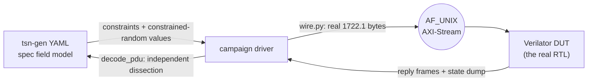

<!--
SPDX-FileCopyrightText: 2026 Kebag Logic
SPDX-License-Identifier: CERN-OHL-W-2.0
-->
# `tsn_fuzz` — IEEE 1722 field-validation campaign

> **2026-08-13 — the 1722.1 campaigns are DELETED.** `fuzz_aecp`, `fuzz_acmp`,
> `fuzz_adp` and the `legacy` smoke driver drove `hdl/ieee17221/{aecp,acmp,adp}`
> engines that no longer exist: this repository's AECP/AEM, ACMP and ADP RTL
> was deleted when the protocol-processor submodule became the control plane.
> Only the **AAF** campaign remains, and it fuzzes `hdl/ieee1722`, which is
> data plane and was not replaced. This is a real coverage loss on IEEE 1722.1
> field fuzzing, not a reorganisation.

**Two** co-simulation campaigns that drive the **real RTL** with spec-modelled
traffic, validate every field of every message, and prove the end-station's
state machines are unmoved by malformed input. AAF fuzzes the 1722 data plane;
`ptp` (added 2026-08-19 for issue #117) fuzzes the 802.1AS **gPTP fabric
plane** — the slice `KL_gptp_shadow` + the real `timestamp_counter` +
`KL_gptp_txstamp`, driving the `gptp-processor` engine both ways. (Four
1722.1 campaigns ran until 2026-08-13 — see the banner above for what went
and why.)

```
make            build the DUTs, run both campaigns and the traceability check
make aaf        AAF / AVTP stream: the listener ACCEPT VERDICT + lock stability
make ptp        gPTP / 802.1AS: TX conformance, parser drops, BTCA, servo,
                the cease rule, and the asCapable canary
make matrix-check   the module<->spec<->test no-drift contract, run by `make`
```

The `ptp` campaign closes the coverage half the 2026-08-13 deletion opened:
`tsn-gen`'s 802.1AS models (`8021as_*.yaml`) carry the full header (unlike the
1722.1 models and their missing nibble — the campaign cross-decodes to prove
it every run), so they serve as both the field oracle and an independent
decoder. It grades the plane's OWN transmissions field-by-field, drives
per-field illegal probes at the parser, and asserts a two-sided asCapable
canary: it must survive every malformed storm and fall in a response drought.
It carries **no tracked gap** at the current pin. The two it carried
during #223's first review round, the portNumber half of the Figure 11-8
requestingPortIdentity arm (FPGA-gPTP #36), are ordinary assertions
since the pin advanced past that fix. The gap it carried during #140's
review round, FPGA-gPTP #22, is fixed and closed: between
the donor's #11 rework and that fix a frame whose messageType no handler
claims was not refused at the parser but dispatched, uncounted, into the
timer program, which TRANSMITS (measured on this slice: one such frame
drew one Pdelay_Req out of the 802.1AS-2011 11.5.2.2 interval against
zero for a quiet control window, and twenty drew ten). Each of the nine
unlisted types is now graded on THREE properties -- the drop counter,
the silence that follows it, and that the engine's uCPU ran no program
at all (the bench wrapper counts `dbg_busy_o` rising edges) -- plus the
servo state a drawn exchange would republish. They are independent: the
donor issue had one candidate fix that would have moved only the counter
and another that would have restored only the silence, and a parser that
BOTH counted and dispatched would satisfy those two while the program
count betrays it. Deleting the pinned parser's type arm turns 29 checks
red, 27 of them the three properties (nine each) and two the servo
state the drawn exchanges republish; making the end-of-frame gate
dispatch what it counts turns exactly the nine program-count checks red
and nothing else in the group. Both figures need re-measuring, and the
triggers are not the same one: ANY check joining the campaign, anywhere,
moves every PASS count quoted anywhere, because a mutation figure is
"total minus the ones that failed"; only a check joining THIS group
moves its FAIL counts. The pass side is the fragile half, since a probe
added at the other end of the file re-prices it. Quote fail counts in
committed documents where you can, for that reason, and re-measure a
quoted pass count whenever the campaign total moves.

The FPGA-gPTP #7 allowances are gone: the three qualifyAnnounce vectors
of 10.3.10.2.1 are ordinary assertions since #136, joined by the
parent's own first-hop, only-hop and stepsRemoved 0x0100 probes. Since
the donor's strict PathTrace validation (FPGA-gPTP #45; 802.1AS-2011
10.5.3.3.4) a present TLV must open with the announced
grandmasterIdentity and carry exactly stepsRemoved+1 identities, and
the parser compares EVERY declared hop with thisClock, publishing one
loop verdict the (c) microcode arm consumes -- the hop walk that a
skip-hop-0 plant once pinned no longer exists to plant against. The
qualification fixtures are wire-legal under those rules, which forces
two shapes: the (b) probes ride the TLV-absent 64-octet Announce,
because stepsRemoved 255 would demand 256 identities and 2052 TLV
octets, past the 1500-octet payload the parser admits -- no consistent
TLV-bearing frame can reach the microcode's STEPS_MAX_C bound, and the
TLV-absent form is the one carrier left; and the first-hop/only-hop
loop probes name US as grandmaster, the only legal head for a path
that starts with us, so their teeth are the parent and AMGM canaries
rather than the GM word. The strict wire rules themselves are pinned
as counted parser drops: a head that is not the announced grandmaster,
a count that is not stepsRemoved+1, and the old wire-illegal
stepsRemoved-255-with-TLV shape, each refused before qualifyAnnounce
sees a bank. The FPGA-gPTP #8
allowance is gone too: since #141 the 11.2.15.3 pairing is
hard-asserted on BOTH halves of Figure 11-8. With nothing armed a
stale sequence and a sequence-0 Follow_Up are refused; with the
pairing armed against the sequenceId THE PLANE sent, a Follow_Up whose
high byte is flipped and one from a different responder are each
refused by their own compare, and a Pdelay_Resp at the flipped
sequence arms nothing. Since #223 the requestingPortIdentity is driven
negatively on both halves as well, and the two halves are NOT the same
authority -- the first cut of #223 said they were, and the [R0] review
of PR #238 was right to refuse it. On the Pdelay_Resp half it is the
figure's own arm: a Pdelay_Resp right in every other respect but
addressed to another station's requestingPortIdentity arms nothing. On
the Follow_Up half it is the ENGINE'S OWN qualification and not an arm
of Figure 11-8 at all. That figure's WAITING_FOR_PDELAY_RESP_FOLLOW_UP
transition qualifies the Follow_Up on its sequenceId and on its
sourcePortIdentity equalling the stored Pdelay_Resp's -- the two
compares `prog_leg_pdpost` implements, which the two probes before it
drive, and which the engine's own microcode header states in exactly
those terms. It does not inspect the Follow_Up's requestingPortIdentity;
`prog_rx_pdrfu` checks it ahead of the pairing because the engine chose
to. So that probe is labelled `engine hardening, not Figure 11-8` and is
NOT conformance evidence for the figure. Each reddens only its own half
when that half's guard is deleted, so the two are separable.

**The portNumber half of the Figure 11-8 arm is implemented and
asserted on both messages.** The figure qualifies the WHOLE
requestingPortIdentity, clockIdentity AND portNumber; the engine's guard
was one 64-bit compare against the parser's bank word 6, so the
portNumber the same parser lands in bank word 7 was never read (its own
header, then: "the clockIdentity alone, never the portNumber").
Measured, not argued: a Pdelay_Resp at our clockIdentity but a foreign
portNumber was taken, the pair completed, neighborPropDelay was
published as 4,054,625 ns where the real exchange had left 599, and
asCapable fell. That is live synchronization state corrupted by a frame
not addressed to this port, so an earlier draft of this file calling it
harmless was wrong and the claim is gone. The campaign carried it as 2
tracked gaps against FPGA-gPTP #36 for one review round; the pin now
names a donor commit that compares bank word 7 against `OUR_PORTNUM_C`
on both Pdelay receive paths, and both observables are ordinary
assertions. On the Pdelay_Resp the term sits beside the clockIdentity
compare; on the Follow_Up path it sits at the head of the PDPOST leg,
because `prog_rx_pdrfu`'s fixed slot has exactly 48 free words behind it
and that is the SERVO leg's only home.

**Four arms, four probes, each separable.** The portNumber arm exists on
the Pdelay_Resp and on the Pdelay_Resp_Follow_Up, so a probe carrying a
stranger's portNumber on BOTH frames of a pair is refused by EITHER of
them and cannot fail for the reason it names -- measured: with the
Pdelay_Resp arm bypassed and that probe as first written, the then
602-check campaign stayed at 602 pass, 0 fail. The Pdelay_Resp probe therefore puts the
stranger's portNumber on the RESPONSE only and a perfect Follow_Up
behind it, and the Follow_Up probe drives the armed pairing. Bypassing
any one of the four arms reddens that arm's probe and no other. A
second Pdelay_Resp pair differs from our portNumber ONLY in the high
byte: the complement differs in both bytes, so a compare silently
narrowed below 16 bits (the class that bit the clockIdentity half,
FPGA-gPTP #30) would still refuse every complement probe, and the
high-byte pair is what a narrowing plant (donor `FMT_W` to `FMT_B` on
the portNumber compare) reddens, by that probe's own name and no
other. Two
ordinary assertions follow the Pdelay_Resp probe, that asCapable is
whole and the delay is re-measured from real exchanges: they were what
stopped the tracked gap from poisoning every section after it, and they
are what will catch a regression of the arm before those sections grade
a poisoned machine. A foreign-domain pair and the replay of
a COMPLETED exchange, identical and t3-skewed, are refused too. Each of
the three compares is pinned by a planted narrowing that the campaign
catches by name, which is why the probes arm against the plane's own
sequenceId rather than the bench's injected-request counter: on the
counter every one of them passes with the compares deleted. The
FPGA-gPTP #10 allowance is gone as well: since #137 the ten reserved
bytes of a two-step Sync (Table 11-8) are graded as an ordinary field,
with the live egress time asserted on the paired Follow_Up, so no gap
marker remains in the file. The two FPGA-gPTP #6 domainNumber gaps
closed with the donor's parser drop arm and the two FPGA-gPTP #9
control-byte gaps with its per-message TX control field, and all four
are ordinary assertions now. A gap fires only on the mismatch, so each
turns green on its own when the donor closes the issue; the machinery
stays for the next tracked donor defect.

**The length oracle is two-sided (issue #217).** The truncation probes
refuse one octet below each per-type minimum; the accept side is one
over-minimum probe per parsed type, the same legal 12-octet
ORGANIZATION_EXTENSION suffix TLV (11.4.2.2 counts every octet through
the last TLV; 11.4.1 makes a receiver ignore a TLV it does not
recognize) riding a Sync, Follow_Up, Pdelay_Req, Pdelay_Resp,
Pdelay_Resp_Follow_Up and Announce, each required to be accepted AND
acted on: the sync pair steers to a delta no earlier section leaves in
the servo, the request is answered with its own sequence, each response
half completes a real exchange and re-measures the published delay
(with the recovery ladder re-climbing behind it), and the Announce is
adopted, in the probe NAMED for length acceptance so the coverage no
longer rides qualification fixtures whose length is incidental to
their purpose. Before this section a parser narrowed to exact declared
length passed the whole campaign for three types and was caught on
Announce only by accident. Each acceptance is pinned by its own
planted narrowing, N10 to N15: restrict the parser's declared-length
arm (the `OFF_MSGLEN_END_C` compare in
`gptp-processor/hdl/wire/KL_gptp_rx_parser.sv`) to one type's exact
minimum with `(mtype_r == MT_x_C) && (acc_nxt_w[15:0] != min_len_w)`,
rebuild, run, restore, and the campaign reds that type's own probe by
name:

| plant | narrowed type | campaign | reddened, by name |
|---|---|---|---|
| N10 | Sync exact 44 | 636 pass, 2 fail | only the suffixed Sync's pair: drop counted, offset never lands |
| N11 | Follow_Up exact 76 | 636 pass, 2 fail | only the suffixed Follow_Up's pair |
| N12 | Pdelay_Req exact 54 | 636 pass, 2 fail | only the suffixed Pdelay_Req: drop counted, never answered |
| N13 | Pdelay_Resp exact 54 | 636 pass, 2 fail | only the suffixed Pdelay_Resp: drop counted, the delay stands |
| N14 | Pdelay_Resp_Follow_Up exact 54 | 636 pass, 2 fail | only the suffixed Resp_Follow_Up: drop counted, the delay stands |
| N15 | Announce exact 64 | 621 pass, 17 fail | the suffixed Announce by name, plus every path-trace-bearing fixture in the campaign (adoption, the 10.3.10.2.1 drop-unmoved probes, steering and storm liveness), since a one-hop trace declares 76 |

N10 to N14 red exactly their own probe's checks and nothing else; N15's
blast radius is the honest shape of an Announce arm that refuses the
10.5.3.3-required TLV. The fail side is quoted per the counting rule
above; re-measure any pass figure whenever the campaign total moves.

Current tally -- **164 AAF checks + 638 gPTP checks + 2 traceability
contracts**, 0 failures, 0 known gaps, with `tsn-gen`
installed. This is what
`make` prints; each campaign rewrites the same line into its `TEST_RESULTS.md`
on
every run, so the generated files are the fresher authority if this table and
they ever disagree:

| campaign | checks | what it drives |
|---|---:|---|
| `fuzz_aaf.py`  | 164 | parser → rx-monitor → depacketizer — the **accept verdict** (wire `stream_id` vs bound, graded on the parser's own pre-match counters = the `0x8B4` APRB sources), per-field verdicts, lock survival |
| `fuzz_ptp.py`  | 638 | the gPTP fabric slice: TX conformance of the plane's own Pdelay_Req/Announce/Sync/Follow_Up against the 802.1AS models (the per-message control byte of FPGA-gPTP #9 among the graded fields: Sync 0x0, Follow_Up 0x2, Announce and the Pdelay types 0x5), parser drop/ignore gates (the domainNumber arm of FPGA-gPTP #6 among them, probed on Announce, Sync/Follow_Up and Pdelay_Req separately), the two-sided length oracle of #217 (each truncation boundary refused and counted one octet below the per-type minimum, and one over-minimum suffix-TLV frame per parsed type accepted and ACTED ON -- answered, exchange-completing, steering, adopted -- each acceptance pinned by its own planted narrowing, N10 to N15 below), BTCA rejection under fuzz (the three 10.3.10.2.1 qualifications of FPGA-gPTP #7 hard-asserted on wire-legal fixtures, each refusal leaving the parser drop counter unmoved, and the strict PathTrace wire rules of FPGA-gPTP #45 -- head not the announced grandmaster, count not stepsRemoved+1 -- pinned as counted parser drops), servo pairing (with the TLV-less, truncated, wrong-tlvType and short-declared Follow_Up refusals of FPGA-gPTP #11), the responder role (with the header-only and truncated Pdelay_Req refusals of FPGA-gPTP #12, neither drawing a response pair), the Milan 4.2.6.2.5 cease rule, and the two-sided asCapable canary; **no tracked gap** at the current pin, the last two having closed with the donor's portNumber compare (FPGA-gPTP #36), and each of the nine unlisted messageTypes is graded on three properties, its counted drop, drawing no transmission, and the engine's uCPU running no program at all (the closed FPGA-gPTP #22 could have been half-fixed in either of two ways, and the third property catches a parser that counts a frame AND dispatches it) |

## Contents

- **[How it works](#how-it-works)** -- The YAML-to-RTL loop in one diagram, and the three-way split of ownership: tsn-gen is the field/constraint oracle, `wire.py` owns the actual bytes, `cosim_axis.h` owns the session — including the 4-byte control frame that requests a state dump, so campaigns observe state machines instead of guessing from replies.
- **[Where the results go](#where-the-results-go)** -- Each campaign writes its `TEST_RESULTS.md` into the folder of the RTL it validates, not a scratch dir, so a block's `doc/` shows its verification status in place. Table of the path. They are generated, so do not hand-edit them, and the committed copy is gated against a fresh run by `scripts/check_results_fresh.py`: the account of the 355-vs-353 drift that gate was written for, and why it normalises the generation timestamp away.
- **[What this suite reports to the sweep](#what-this-suite-reports-to-the-sweep)** -- The lines `scripts/suite_tally.py` counts (each campaign's own total, the traceability check's two contracts, and one freshness check per generated artifact), and the one it deliberately does *not*: `SUITE-SKIP:`, which says the optional campaign ran nothing. Why the marker is reporting rather than a verdict, it does not clear `NOCOUNT` and letting it would hide a campaign behind a green sweep, why the traceability check counts 2 and not 63, and why freshness bills 1 and bills nothing at all on a skip.
- **[Why "state stability" is the real gate](#why-state-stability-is-the-real-gate)** -- The argument for what this suite actually asserts: there is no software here to crash, so the test is that garbage does not *move state*. Each campaign's canary is named, including AAF's two-sided one — stay locked through malformed PDUs, but DO unlock during an accept drought, because a listener reporting MEDIA_LOCKED while accepting nothing is lying to the controller.
- **[⚠ tsn-gen wire-layout caveat (measured 2026-07-25)](#-tsn-gen-wire-layout-caveat-measured-2026-07-25)** -- The measured defect in the generator's own models: they omit the AVTPDU `sv`+`version` nibble, so a real READ_DESCRIPTOR decodes `control_data_length` 320 instead of 20. Explains the one-nibble shift `decode_pdu()` applies and why the models are used as an oracle but never as a frame builder.
- **[Historical AECP findings](#historical-aecp-findings)** -- Preserves the open legacy LOCK_ENTITY finding and records issue #48 as resolved by the current processor regression over exact 38 through 45 byte foreign-target commands.
- **[Adding a campaign](#adding-a-campaign)** -- Four steps for a new PDU family, and the rule that keeps the campaigns from ossifying: assert invariants, not the entity model — the DUT decides which descriptors exist, the campaign decides the answer is well-formed and state-stable.

## How it works



* **tsn-gen is the field/constraint oracle.** Each PDU's YAML gives every
  field's width and its spec constraint (`value` / `values` / `range` /
  `mask`); `tsn_model.py` turns those into per-field *legal* and *illegal*
  probe sets, plus reproducible constrained-random field sets via
  `packet_gen --seed`. **Exactly one kind per field.** A field declaring two
  or more (say `value: 3` beside `values: [1, 2, 3]`) is refused, fail-closed,
  with one message naming the field and every kind it declares. The rule is
  a single predicate, `tsn_model.kind_conflict()`, and `legal()`, `illegal()`
  and `fuzz_ptp.grade_tx()` all ask it before they dispatch, so the three
  readers cannot resolve a combination three ways (#151). Upstream resolves
  it a fourth way -- `packet_builder.cpp::pickValue` merges `value` into
  `values` and drops a `mask` or `range` standing beside them -- which is why
  the combination is refused rather than re-resolved. No model at the pinned
  tsn-gen rev declares two kinds (0 of 241 constrained fields across the 31
  model files), so the campaign tallies do not move; `test_grade_tx.py`
  proves the refusal by mutating the predicate and watching every refusal
  case go red.
* **`wire.py` owns the bytes.** It encodes/decodes the REAL 1722.1 layouts —
  the ones the silicon-proven C++ testbenches and the deployed boards use —
  and self-tests against their vectors (`python3 wire.py`).
* **`cosim_axis.h` owns the session.** Every DUT sends *all* frames a
  command produced, then an empty terminator, so silence, one reply, and
  reply-plus-unsolicited-notification are unambiguous. A 4-byte control
  frame (`0xC0 0x51 op arg`) requests a **state dump**, a timer tick, a
  reset, or an event — that is how the campaigns observe state machines
  rather than guessing from replies.

## Where the results go

Each campaign writes `TEST_RESULTS.md` **into the folder of the RTL it
validates**, not into a scratch directory — someone opening a block's `doc/`
sees that block's verification status in place, without knowing this campaign
exists:

| campaign | results file |
|---|---|
| `make aaf`  | [`hdl/ieee1722/avtp/doc/TEST_RESULTS.md`](../../../hdl/ieee1722/avtp/doc/TEST_RESULTS.md) (pointer in `hdl/ieee1722/aaf/doc/`) |
| `make ptp`  | [`hdl/ieee8021as/gptp_plane/doc/TEST_RESULTS.md`](../../../hdl/ieee8021as/gptp_plane/doc/TEST_RESULTS.md) |

Each file records the verdict, the DUT, the exact RTL files under test, the
per-section pass/fail/gap breakdown, every tracked gap, and the one-line
reproduce command. They are generated — do not hand-edit.

**And the committed copy is gated against a fresh run.**
`scripts/check_results_fresh.py` runs at the end of each campaign target and
fails the suite when what is committed is not what the campaign produces. It
exists because that drifted silently: the gPTP file claimed `355 pass, 0 fail`
while a fresh run at the CI-pinned tsn-gen rev produced `353 pass, 0 fail`, and
no gate anywhere went red. Nothing had broken. The tsn-gen field oracle had
unpinned `correction_field` on Pdelay_Req and `steps_removed` on Announce, both
for good spec reasons, and `grade_tx()` skips a field carrying no constraint -
so two checks stopped being graded and the file went on asserting the old
number. Zero failures is exactly the shape in which this kind of drift hides,
which is why the gate compares the whole substance and not just the verdict.

The comparison normalises the generation timestamp away on both sides. Without
that it would be red on every run for no reason at all: these files are
rewritten in place by any sweep, so `git status` shows them modified whenever
the clock has moved. The standing rule for that stays what it was - commit them
when the counts move, revert them when only the timestamp did - and the gate
now enforces the first half of it.

## What this suite reports to the sweep

`scripts/suite_tally.py` turns per-suite logs into the sweep's headline check
count. This suite emits the campaign lines it reads — those that count and the
skip markers that deliberately do not:

| line | when | counts |
|---|---|---|
| `== AAF/AVTP stream field campaign (tsn-gen driven): N pass, 0 fail, 0 known gaps ==` | tsn-gen present | **N** |
| `== gPTP/802.1AS field campaign (tsn-gen driven): M pass, 0 fail, K known gaps ==` | tsn-gen present | **M** |
| `traceability contracts (drift + ratchet): 2 checks: 2 PASS, 0 FAIL` | always, if the matrix check passed | **2** |
| `campaign artifact freshness (<artifact>): 1 checks: 1 PASS, 0 FAIL` | tsn-gen present, once per campaign | **1** each |
| `SUITE-SKIP: AAF/AVTP field campaign (tsn-gen absent; …)` | tsn-gen absent | **0** |
| `SUITE-SKIP: gPTP/802.1AS field campaign (tsn-gen absent; …)` | tsn-gen absent | **0** |
| `SUITE-SKIP: <artifact> freshness not checked (…)` | tsn-gen absent, or no git metadata | **0** |

So the suite reports `2` on a machine without tsn-gen and `N + M + 4` with it.
Each campaign is guarded independently: `suite_tally.py --campaign-guard` runs
against each campaign's own log, so neither can drop its checks behind a
reworded summary. (The gPTP campaign's `known gaps` count is tracked
separately (see the campaign table above); the guard counts pass/fail,
and a gap is neither.)

**The freshness lines are one check each, and only one.**
`check_results_fresh.py` asserts that the committed `TEST_RESULTS.md` equals
what the run that just finished produced, with the generation timestamp
normalised away on both sides, and only on the headline that carries it. Two
further assertions guard that comparison rather than standing beside it: the
artifact's headline tally must equal the tally in the log being judged, so a
leftover file from an earlier run cannot vouch for a committed copy, and the
artifact's own section rows must add up to its headline, so a file that
contradicts itself is refused instead of compared. Neither can hold while the
comparison is meaningful, and both refuse outright rather than returning a
verdict. Understating is the safe direction, so the line bills 1.

**And it never bills anything on a skip.** The campaigns need tsn-gen, so
without it there is no fresh result to compare and the gate says exactly that.
A `1 PASS` there would vouch for the committed copy on the strength of having
checked nothing - which is the failure this gate exists to prevent, repeated in
its own reporting.

**The `2` is what makes this suite countable at all.** Before it, the suite
printed no count shape whatever when the campaign skipped, so it was classed
`NOCOUNT` and the sweep failed on a machine without the generator. The
traceability check runs on *every* invocation and was reporting nothing.

Two, because `gen_module_matrix.py --check` gates two independent contracts
under one exit code: the 13 generated artifacts are not stale, and the
untested-module ratchet has not slipped. Either can fail while the other holds.
Not 63 — the ratchet *inspects* 63 modules to reach one verdict, and billing the
headline 63 checks for two assertions would inflate it.

**`SUITE-SKIP:` is reporting, not a verdict.** It says why the total is smaller
and nothing else. In particular it does **not** excuse this suite from
producing a count: a log whose only content is the marker is still a `NOCOUNT`.
That rule is not a detail — letting a marker suppress `NOCOUNT` makes the
verdict a suite's own to declare, and measured on a real sweep it let 72% of
the checks vanish behind a green run. The `2` above is how this suite skips
honestly: by still reporting what it *did* run.

It must also never be given pass/fail numbers. A skip worded `0 pass, 0 fail`
matches the campaign shape in the table above and would read as a campaign that
ran and checked nothing. `suite_tally.py`'s self-test pins all of it —
`skip-adds-nothing`, `skip-line-is-not-a-hiding-place`,
`skip-prose-is-not-a-marker`, `skip-marker-must-start-the-line`, and the
`nocount-*` cases that exercise the classification itself.

## Why "state stability" is the real gate

Fuzzing an entity to see if it crashes is a weak test — this RTL has no
software to crash. What matters is that **garbage does not move state**. So
every campaign interleaves storms with a *canary*. Two remain — AAF's lock
and gPTP's asCapable; the AECP, ACMP and ADP canaries went with their
campaigns on 2026-08-13:

* AAF requires the stream to **stay locked** through every malformed PDU —
  an unlock is an audible dropout and a Milan compliance failure — and,
  inversely, requires it to **unlock** during a sustained accept drought: a
  listener still reporting `MEDIA_LOCKED` while it accepts nothing is lying
  to the controller. The accept verdict itself is graded on the parser's
  free-running `parsed`/`matched` counters (what `milan_datapath` publishes
  as `APRB_PARSED`/`APRB_MATCHED`), so *PARSED climbs, MATCHED static* is a
  verdict the campaign states rather than infers — every single-bit flip of
  the 64-bit `stream_id`, the byte-reversal, the `SID_LO`/`SID_HI`
  transposition, per-byte corruption, the C-VLAN-tagged path both ways, and
  a seeded random `stream_id` population against an exact model.

* gPTP requires **asCapable** to survive every malformed 802.1AS storm —
  the plane transmitting Announce/Sync on a false asCapable is the gPTP
  equivalent of the MEDIA_LOCKED lie — and, inversely, to **fall** in a
  sustained Pdelay response drought and climb again when exchanges resume.
  Because the plane is timer-driven, the campaign also grades its OWN
  transmissions (the publish bank and the plane's Pdelay_Req/Announce/Sync/
  Follow_Up), not just what it accepts. The tracked gaps are the places a
  malformed frame DOES move state today, each with a dedicated probe and an
  FPGA-gPTP issue, so the canary stays honest about what it cannot yet
  promise: today there are none, and the nine unlisted messageTypes that
  were the last of them are graded twice over, on the drop counter AND
  on the silence, because neither half of FPGA-gPTP #22 implied the
  other. The foreign-domain vector was the first gap to close (FPGA-gPTP
  #6); its Announce and Sync/Follow_Up probes stayed separate so one fixed
  path cannot hide the other. The Sync and Follow_Up control byte (FPGA-gPTP
  #9) was the second: the 802.1AS models pin it per message, so `grade_tx`
  asserts it like any other header field.

## ⚠ tsn-gen wire-layout caveat (measured 2026-07-25)

tsn-gen's 1722.1 models **omit the AVTPDU `sv`(1)+`version`(3) nibble**: the
ADP model declares 532 bits where the real ADPDU-after-subtype is 536, and
each `atdecc_aecp_*` model re-declares the `message_type` that
`avtp_control_header` already spent a byte on. Consequences, both reproduced
against real frames:

* a `--stack-file` frame is **4 bits wide** of the real wire after the AVTP
  header — a real `READ_DESCRIPTOR` decodes `control_data_length` 320 instead
  of 20 and `command_type` 64 instead of 4;
* the same model applied at the real PDU offset is **4 bits short**.

So the models are used as the field/constraint oracle only, never as the
frame builder. `tsn_model.decode_pdu()` shifts the PDU left one nibble before
handing it to `packet_gen --decode`; with that correction tsn-gen decodes
real frames exactly and serves as a genuine independent decoder (the ADP
campaign cross-checked 12 fields this way, before it was deleted).

## Historical AECP findings

The AECP campaign was deleted on 2026-08-13 with the legacy RTL it fuzzed.
The surviving AAF campaign reports **0 known gaps**, so these findings are not
measured by `tsn_fuzz`.

### Open legacy finding

**`LOCK_ENTITY` ignores `descriptor_type`/`descriptor_index`** and answers
SUCCESS for any value. Section 7.4.2 scopes LOCK to the ENTITY descriptor, so
a foreign descriptor should draw `NO_SUCH_DESCRIPTOR`. Sibling
`ACQUIRE_ENTITY` answers `NOT_SUPPORTED` and is unaffected. This has low
impact because real controllers send `ENTITY/0`.

### Resolved finding: issue #48

The deleted legacy parser answered unpadded AECP frames below 45 bytes even
when they carried a foreign `target_entity_id`. Ethernet padding hid the bug
on a real link. The current protocol processor captures the complete common
header before dispatch and applies the entity filter before any short-command
response path. Its `tb/pp_top` A7b regression sends exact 38 through 45 byte
READ_DESCRIPTOR commands to a foreign target and requires silence for every
length.

## Adding a campaign

1. Write `cosim_<x>.cpp` including `cosim_axis.h`; implement the handler
   (wire frames + the four control opcodes) and a `state_dump()` whose word
   order is documented as the contract with the driver.
2. Add the Verilator recipe to the `Makefile`.
3. Write `fuzz_<x>.py` using `cosim.Report` / `cosim.Dut`, take field values
   from `tsn_model`, and build bytes with `wire.py`.
4. Assert **invariants**, not the entity model: the DUT decides which
   descriptors exist, the campaign decides that the answer is always
   well-formed, correctly addressed, and state-stable.
