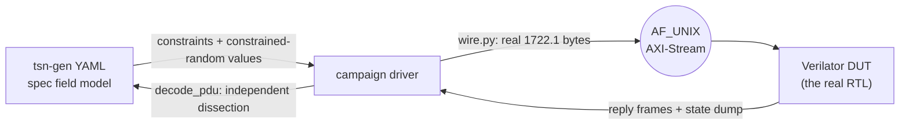

<!--
SPDX-FileCopyrightText: 2026 Kebag Logic
SPDX-License-Identifier: CERN-OHL-W-2.0
-->
# `tsn_fuzz` — IEEE 1722.1 / 1722 field-validation campaign

Four co-simulation campaigns that drive the **real RTL** with spec-modelled
1722.1 traffic, validate every field of every message, and prove the
end-station's state machines are unmoved by malformed input.

```
make            build the DUTs and run everything   (~3 min)
make aecp       AECP / AEM getter-setter + descriptor sweep
make acmp       ACMP connection management + listener state machine
make adp        ADP discovery: every advertised field at its wire offset
make aaf        AAF / AVTP stream: the listener ACCEPT VERDICT + lock stability
make legacy     the original 14-command cosim smoke driver
TSN_FUZZ_VERBOSE=1 make aecp     print passing checks too
```

Current tally — 3153 checks, 0 failures, 2 tracked gaps:

| campaign | checks | what it drives |
|---|---:|---|
| `fuzz_aecp.py` | 2644 | `KL_aecp_top` — 16 tsn-gen command models, 9 getters × 19 descriptor types, 8 setters, header fuzz, addressing/length |
| `fuzz_adp.py`  | 222 | `adp_advertiser` — 20 advertised fields, events, `available_index`, departing |
| `fuzz_acmp.py` | 123 | `KL_acmp_listener` — 15 ACMP fields, all 16 message types, BIND→state→UNBIND |
| `fuzz_aaf.py`  | 164 | parser → rx-monitor → depacketizer — the **accept verdict** (wire `stream_id` vs bound, graded on the parser's own pre-match counters = the `0x8B4` APRB sources), per-field verdicts, lock survival |

## Contents

- **[How it works](#how-it-works)** — The YAML-to-RTL loop in one diagram, and the three-way split of ownership: tsn-gen is the field/constraint oracle, `wire.py` owns the actual bytes, `cosim_axis.h` owns the session — including the 4-byte control frame that requests a state dump, so campaigns observe state machines instead of guessing from replies.
- **[Where the results go](#where-the-results-go)** — Each campaign writes its `TEST_RESULTS.md` into the folder of the RTL it validates, not a scratch dir, so a block's `doc/` shows its verification status in place. Table of the four paths. They are generated — do not hand-edit.
- **[Why "state stability" is the real gate](#why-state-stability-is-the-real-gate)** — The argument for what this suite actually asserts: there is no software here to crash, so the test is that garbage does not *move state*. Each campaign's canary is named, including AAF's two-sided one — stay locked through malformed PDUs, but DO unlock during an accept drought, because a listener reporting MEDIA_LOCKED while accepting nothing is lying to the controller.
- **[⚠ tsn-gen wire-layout caveat (measured 2026-07-25)](#-tsn-gen-wire-layout-caveat-measured-2026-07-25)** — The measured defect in the generator's own models: they omit the AVTPDU `sv`+`version` nibble, so a real READ_DESCRIPTOR decodes `control_data_length` 320 instead of 20. Explains the one-nibble shift `decode_pdu()` applies and why the models are used as an oracle but never as a frame builder.
- **[Tracked gaps (visible, counted, non-failing)](#tracked-gaps-visible-counted-non-failing)** — Two defects this campaign found, each printed as `[GAP ]` rather than swept up: `LOCK_ENTITY` answering SUCCESS for any descriptor, and undersized frames bypassing the entity-id filter — with the honest impact assessment (the second is unreachable on a real link at Ethernet's 60-byte minimum).
- **[Adding a campaign](#adding-a-campaign)** — Four steps for a new PDU family, and the rule that keeps the campaigns from ossifying: assert invariants, not the entity model — the DUT decides which descriptors exist, the campaign decides the answer is well-formed and state-stable.

## How it works



* **tsn-gen is the field/constraint oracle.** Each PDU's YAML gives every
  field's width and its spec constraint (`value` / `values` / `range` /
  `mask`); `tsn_model.py` turns those into per-field *legal* and *illegal*
  probe sets, plus reproducible constrained-random field sets via
  `packet_gen --seed`.
* **`wire.py` owns the bytes.** It encodes/decodes the REAL 1722.1 layouts —
  the ones the silicon-proven C++ testbenches and the deployed boards use —
  and self-tests against their vectors (`python3 wire.py`).
* **`cosim_axis.h` owns the session.** Every DUT sends *all* frames a
  command produced, then an empty terminator, so silence, one reply, and
  reply-plus-unsolicited-notification are unambiguous. A 4-byte control
  frame (`0xC0 0x51 op arg`) requests a **state dump**, a timer tick, a
  reset, or an event — that is how the campaigns observe state machines
  rather than guessing from replies.

## Where the results go

Each campaign writes `TEST_RESULTS.md` **into the folder of the RTL it
validates**, not into a scratch directory — someone opening a block's `doc/`
sees that block's verification status in place, without knowing this campaign
exists:

| campaign | results file |
|---|---|
| `make aecp` | [`hdl/ieee17221/aecp/doc/TEST_RESULTS.md`](../../../hdl/ieee17221/aecp/doc/TEST_RESULTS.md) |
| `make acmp` | [`hdl/ieee17221/acmp/doc/TEST_RESULTS.md`](../../../hdl/ieee17221/acmp/doc/TEST_RESULTS.md) |
| `make adp`  | [`hdl/ieee17221/adp/doc/TEST_RESULTS.md`](../../../hdl/ieee17221/adp/doc/TEST_RESULTS.md) |
| `make aaf`  | [`hdl/ieee1722/avtp/doc/TEST_RESULTS.md`](../../../hdl/ieee1722/avtp/doc/TEST_RESULTS.md) (pointer in `hdl/ieee1722/aaf/doc/`) |

Each file records the verdict, the DUT, the exact RTL files under test, the
per-section pass/fail/gap breakdown, every tracked gap, and the one-line
reproduce command. They are generated — do not hand-edit.

## Why "state stability" is the real gate

Fuzzing an entity to see if it crashes is a weak test — this RTL has no
software to crash. What matters is that **garbage does not move state**. So
every campaign interleaves storms with a *canary*:

* AECP replays `READ_DESCRIPTOR(ENTITY,0)` and requires it **byte-identical**
  to the pre-storm baseline;
* ACMP requires `state_o` to stay inside the eight legal LSM states, never
  wedge, and a legitimate BIND to still work afterwards;
* ADP requires a complete, correct 82-byte ADPDU after an event storm;
* AAF requires the stream to **stay locked** through every malformed PDU —
  an unlock is an audible dropout and a Milan compliance failure — and,
  inversely, requires it to **unlock** during a sustained accept drought: a
  listener still reporting `MEDIA_LOCKED` while it accepts nothing is lying
  to the controller. The accept verdict itself is graded on the parser's
  free-running `parsed`/`matched` counters (what `milan_datapath` publishes
  as `APRB_PARSED`/`APRB_MATCHED`), so *PARSED climbs, MATCHED static* is a
  verdict the campaign states rather than infers — every single-bit flip of
  the 64-bit `stream_id`, the byte-reversal, the `SID_LO`/`SID_HI`
  transposition, per-byte corruption, the C-VLAN-tagged path both ways, and
  a seeded random `stream_id` population against an exact model.

## ⚠ tsn-gen wire-layout caveat (measured 2026-07-25)

tsn-gen's 1722.1 models **omit the AVTPDU `sv`(1)+`version`(3) nibble**: the
ADP model declares 532 bits where the real ADPDU-after-subtype is 536, and
each `atdecc_aecp_*` model re-declares the `message_type` that
`avtp_control_header` already spent a byte on. Consequences, both reproduced
against real frames:

* a `--stack-file` frame is **4 bits wide** of the real wire after the AVTP
  header — a real `READ_DESCRIPTOR` decodes `control_data_length` 320 instead
  of 20 and `command_type` 64 instead of 4;
* the same model applied at the real PDU offset is **4 bits short**.

So the models are used as the field/constraint oracle only, never as the
frame builder. `tsn_model.decode_pdu()` shifts the PDU left one nibble before
handing it to `packet_gen --decode`; with that correction tsn-gen decodes
real frames exactly and serves as a genuine independent decoder (the ADP
campaign cross-checks 12 fields this way).

## Tracked gaps (visible, counted, non-failing)

Printed as `[GAP ]` and listed in each campaign's summary. Both were found by
this campaign:

1. **`LOCK_ENTITY` ignores `descriptor_type`/`descriptor_index`** and answers
   SUCCESS for any value; §7.4.2 scopes LOCK to the ENTITY descriptor, so a
   foreign descriptor should draw `NO_SUCH_DESCRIPTOR`. Sibling
   `ACQUIRE_ENTITY` answers `NOT_SUPPORTED` and is unaffected. Low impact —
   every real controller sends `ENTITY/0`.
2. **Undersized frames bypass the entity-id filter.** AECP frames ≤ 44 bytes
   addressed to a *foreign* `target_entity_id` are answered anyway (and echo
   *our* id); ≥ 45 bytes filter correctly. **Unreachable on a real link** —
   Ethernet's 60-byte minimum means a MAC never delivers such a frame, and
   the padded (real-wire) case is asserted to be silent. Latent robustness
   gap, not a live exposure.

## Adding a campaign

1. Write `cosim_<x>.cpp` including `cosim_axis.h`; implement the handler
   (wire frames + the four control opcodes) and a `state_dump()` whose word
   order is documented as the contract with the driver.
2. Add the Verilator recipe to the `Makefile`.
3. Write `fuzz_<x>.py` using `cosim.Report` / `cosim.Dut`, take field values
   from `tsn_model`, and build bytes with `wire.py`.
4. Assert **invariants**, not the entity model: the DUT decides which
   descriptors exist, the campaign decides that the answer is always
   well-formed, correctly addressed, and state-stable.
