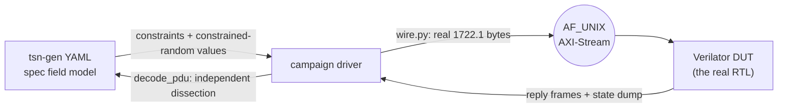

<!--
SPDX-FileCopyrightText: 2026 Kebag Logic
SPDX-License-Identifier: CERN-OHL-W-2.0
-->
# `tsn_fuzz` — IEEE 1722 field-validation campaign

> **2026-08-13 — the 1722.1 campaigns are DELETED.** `fuzz_aecp`, `fuzz_acmp`,
> `fuzz_adp` and the `legacy` smoke driver drove `hdl/ieee17221/{aecp,acmp,adp}`
> engines that no longer exist: this repository's AECP/AEM, ACMP and ADP RTL
> was deleted when the protocol-processor submodule became the control plane.
> Only the **AAF** campaign remains, and it fuzzes `hdl/ieee1722`, which is
> data plane and was not replaced. This is a real coverage loss on IEEE 1722.1
> field fuzzing, not a reorganisation.

**Two** co-simulation campaigns that drive the **real RTL** with spec-modelled
traffic, validate every field of every message, and prove the end-station's
state machines are unmoved by malformed input. AAF fuzzes the 1722 data plane;
`ptp` (added 2026-08-19 for issue #117) fuzzes the 802.1AS **gPTP fabric
plane** — the slice `KL_gptp_shadow` + the real `timestamp_counter` +
`KL_gptp_txstamp`, driving the `gptp-processor` engine both ways. (Four
1722.1 campaigns ran until 2026-08-13 — see the banner above for what went
and why.)

```
make            build the DUTs, run both campaigns and the traceability check
make aaf        AAF / AVTP stream: the listener ACCEPT VERDICT + lock stability
make ptp        gPTP / 802.1AS: TX conformance, parser drops, BTCA, servo,
                the cease rule, and the asCapable canary
make matrix-check   the module<->spec<->test no-drift contract, run by `make`
```

The `ptp` campaign closes the coverage half the 2026-08-13 deletion opened:
`tsn-gen`'s 802.1AS models (`8021as_*.yaml`) carry the full header (unlike the
1722.1 models and their missing nibble — the campaign cross-decodes to prove
it every run), so they serve as both the field oracle and an independent
decoder. It grades the plane's OWN transmissions field-by-field, drives
per-field illegal probes at the parser, and asserts a two-sided asCapable
canary: it must survive every malformed storm and fall in a response drought.
It carries **9 tracked gaps** naming FPGA-gPTP issues #6–#10 (receive-path
domain/qualifyAnnounce/Resp_Follow_Up qualification, and two TX-only field
nonconformances). A gap fires only on the mismatch, so each turns green on its
own when the donor closes the issue.

Current tally — **164 AAF checks + ~354 gPTP checks + 2 traceability
contracts**, 0 failures, 9 known gaps, with `tsn-gen` installed. This is what
`make` prints; each campaign rewrites the same line into its `TEST_RESULTS.md`
on
every run, so the generated files are the fresher authority if this table and
they ever disagree:

| campaign | checks | what it drives |
|---|---:|---|
| `fuzz_aaf.py`  | 164 | parser → rx-monitor → depacketizer — the **accept verdict** (wire `stream_id` vs bound, graded on the parser's own pre-match counters = the `0x8B4` APRB sources), per-field verdicts, lock survival |
| `fuzz_ptp.py`  | ~354 | the gPTP fabric slice — TX conformance of the plane's own Pdelay_Req/Announce/Sync/Follow_Up against the 802.1AS models, parser drop/ignore gates, BTCA rejection under fuzz, servo pairing, the Milan 4.2.6.2.5 cease rule, and the two-sided asCapable canary; **9 gaps** track FPGA-gPTP #6–#10 |

## Contents

- **[How it works](#how-it-works)** -- The YAML-to-RTL loop in one diagram, and the three-way split of ownership: tsn-gen is the field/constraint oracle, `wire.py` owns the actual bytes, `cosim_axis.h` owns the session — including the 4-byte control frame that requests a state dump, so campaigns observe state machines instead of guessing from replies.
- **[Where the results go](#where-the-results-go)** -- Each campaign writes its `TEST_RESULTS.md` into the folder of the RTL it validates, not a scratch dir, so a block's `doc/` shows its verification status in place. Table of the path. They are generated — do not hand-edit.
- **[What this suite reports to the sweep](#what-this-suite-reports-to-the-sweep)** -- The two lines `scripts/suite_tally.py` counts (the campaign's own total, and the traceability check's two contracts), and the third it deliberately does *not*: `SUITE-SKIP:`, which says the optional campaign ran nothing. Why the marker is reporting rather than a verdict — it does not clear `NOCOUNT`, and letting it would hide a campaign behind a green sweep — and why the traceability check counts 2 and not 63.
- **[Why "state stability" is the real gate](#why-state-stability-is-the-real-gate)** -- The argument for what this suite actually asserts: there is no software here to crash, so the test is that garbage does not *move state*. Each campaign's canary is named, including AAF's two-sided one — stay locked through malformed PDUs, but DO unlock during an accept drought, because a listener reporting MEDIA_LOCKED while accepting nothing is lying to the controller.
- **[⚠ tsn-gen wire-layout caveat (measured 2026-07-25)](#-tsn-gen-wire-layout-caveat-measured-2026-07-25)** -- The measured defect in the generator's own models: they omit the AVTPDU `sv`+`version` nibble, so a real READ_DESCRIPTOR decodes `control_data_length` 320 instead of 20. Explains the one-nibble shift `decode_pdu()` applies and why the models are used as an oracle but never as a frame builder.
- **[Historical AECP findings](#historical-aecp-findings)** -- Preserves the open legacy LOCK_ENTITY finding and records issue #48 as resolved by the current processor regression over exact 38 through 45 byte foreign-target commands.
- **[Adding a campaign](#adding-a-campaign)** -- Four steps for a new PDU family, and the rule that keeps the campaigns from ossifying: assert invariants, not the entity model — the DUT decides which descriptors exist, the campaign decides the answer is well-formed and state-stable.

## How it works



* **tsn-gen is the field/constraint oracle.** Each PDU's YAML gives every
  field's width and its spec constraint (`value` / `values` / `range` /
  `mask`); `tsn_model.py` turns those into per-field *legal* and *illegal*
  probe sets, plus reproducible constrained-random field sets via
  `packet_gen --seed`.
* **`wire.py` owns the bytes.** It encodes/decodes the REAL 1722.1 layouts —
  the ones the silicon-proven C++ testbenches and the deployed boards use —
  and self-tests against their vectors (`python3 wire.py`).
* **`cosim_axis.h` owns the session.** Every DUT sends *all* frames a
  command produced, then an empty terminator, so silence, one reply, and
  reply-plus-unsolicited-notification are unambiguous. A 4-byte control
  frame (`0xC0 0x51 op arg`) requests a **state dump**, a timer tick, a
  reset, or an event — that is how the campaigns observe state machines
  rather than guessing from replies.

## Where the results go

Each campaign writes `TEST_RESULTS.md` **into the folder of the RTL it
validates**, not into a scratch directory — someone opening a block's `doc/`
sees that block's verification status in place, without knowing this campaign
exists:

| campaign | results file |
|---|---|
| `make aaf`  | [`hdl/ieee1722/avtp/doc/TEST_RESULTS.md`](../../../hdl/ieee1722/avtp/doc/TEST_RESULTS.md) (pointer in `hdl/ieee1722/aaf/doc/`) |
| `make ptp`  | [`hdl/ieee8021as/gptp_plane/doc/TEST_RESULTS.md`](../../../hdl/ieee8021as/gptp_plane/doc/TEST_RESULTS.md) |

Each file records the verdict, the DUT, the exact RTL files under test, the
per-section pass/fail/gap breakdown, every tracked gap, and the one-line
reproduce command. They are generated — do not hand-edit.

## What this suite reports to the sweep

`scripts/suite_tally.py` turns per-suite logs into the sweep's headline check
count. This suite emits the campaign lines it reads — those that count and the
skip markers that deliberately do not:

| line | when | counts |
|---|---|---|
| `== AAF/AVTP stream field campaign (tsn-gen driven): N pass, 0 fail, 0 known gaps ==` | tsn-gen present | **N** |
| `== gPTP/802.1AS field campaign (tsn-gen driven): M pass, 0 fail, 9 known gaps ==` | tsn-gen present | **M** |
| `traceability contracts (drift + ratchet): 2 checks: 2 PASS, 0 FAIL` | always, if the matrix check passed | **2** |
| `SUITE-SKIP: AAF/AVTP field campaign (tsn-gen absent; …)` | tsn-gen absent | **0** |
| `SUITE-SKIP: gPTP/802.1AS field campaign (tsn-gen absent; …)` | tsn-gen absent | **0** |

So the suite reports `2` on a machine without tsn-gen and `N + M + 2` with it.
Each campaign is guarded independently: `suite_tally.py --campaign-guard` runs
against each campaign's own log, so neither can drop its checks behind a
reworded summary. (The gPTP campaign's `known gaps` count is nonzero and
tracked — see the campaign table above; the guard counts pass/fail, and a gap
is neither.)

**The `2` is what makes this suite countable at all.** Before it, the suite
printed no count shape whatever when the campaign skipped, so it was classed
`NOCOUNT` and the sweep failed on a machine without the generator. The
traceability check runs on *every* invocation and was reporting nothing.

Two, because `gen_module_matrix.py --check` gates two independent contracts
under one exit code: the 13 generated artifacts are not stale, and the
untested-module ratchet has not slipped. Either can fail while the other holds.
Not 63 — the ratchet *inspects* 63 modules to reach one verdict, and billing the
headline 63 checks for two assertions would inflate it.

**`SUITE-SKIP:` is reporting, not a verdict.** It says why the total is smaller
and nothing else. In particular it does **not** excuse this suite from
producing a count: a log whose only content is the marker is still a `NOCOUNT`.
That rule is not a detail — letting a marker suppress `NOCOUNT` makes the
verdict a suite's own to declare, and measured on a real sweep it let 72% of
the checks vanish behind a green run. The `2` above is how this suite skips
honestly: by still reporting what it *did* run.

It must also never be given pass/fail numbers. A skip worded `0 pass, 0 fail`
matches the campaign shape in the table above and would read as a campaign that
ran and checked nothing. `suite_tally.py`'s self-test pins all of it —
`skip-adds-nothing`, `skip-line-is-not-a-hiding-place`,
`skip-prose-is-not-a-marker`, `skip-marker-must-start-the-line`, and the
`nocount-*` cases that exercise the classification itself.

## Why "state stability" is the real gate

Fuzzing an entity to see if it crashes is a weak test — this RTL has no
software to crash. What matters is that **garbage does not move state**. So
every campaign interleaves storms with a *canary*. Two remain — AAF's lock
and gPTP's asCapable; the AECP, ACMP and ADP canaries went with their
campaigns on 2026-08-13:

* AAF requires the stream to **stay locked** through every malformed PDU —
  an unlock is an audible dropout and a Milan compliance failure — and,
  inversely, requires it to **unlock** during a sustained accept drought: a
  listener still reporting `MEDIA_LOCKED` while it accepts nothing is lying
  to the controller. The accept verdict itself is graded on the parser's
  free-running `parsed`/`matched` counters (what `milan_datapath` publishes
  as `APRB_PARSED`/`APRB_MATCHED`), so *PARSED climbs, MATCHED static* is a
  verdict the campaign states rather than infers — every single-bit flip of
  the 64-bit `stream_id`, the byte-reversal, the `SID_LO`/`SID_HI`
  transposition, per-byte corruption, the C-VLAN-tagged path both ways, and
  a seeded random `stream_id` population against an exact model.

* gPTP requires **asCapable** to survive every malformed 802.1AS storm —
  the plane transmitting Announce/Sync on a false asCapable is the gPTP
  equivalent of the MEDIA_LOCKED lie — and, inversely, to **fall** in a
  sustained Pdelay response drought and climb again when exchanges resume.
  Because the plane is timer-driven, the campaign also grades its OWN
  transmissions (the publish bank and the plane's Pdelay_Req/Announce/Sync/
  Follow_Up), not just what it accepts. The nine tracked gaps are the
  places a malformed frame DOES move state today (a foreign-domain vector,
  an unqualified Announce, a stale Pdelay_Resp_Follow_Up) — each with a
  dedicated probe and an FPGA-gPTP issue, so the canary stays honest about
  what it cannot yet promise.

## ⚠ tsn-gen wire-layout caveat (measured 2026-07-25)

tsn-gen's 1722.1 models **omit the AVTPDU `sv`(1)+`version`(3) nibble**: the
ADP model declares 532 bits where the real ADPDU-after-subtype is 536, and
each `atdecc_aecp_*` model re-declares the `message_type` that
`avtp_control_header` already spent a byte on. Consequences, both reproduced
against real frames:

* a `--stack-file` frame is **4 bits wide** of the real wire after the AVTP
  header — a real `READ_DESCRIPTOR` decodes `control_data_length` 320 instead
  of 20 and `command_type` 64 instead of 4;
* the same model applied at the real PDU offset is **4 bits short**.

So the models are used as the field/constraint oracle only, never as the
frame builder. `tsn_model.decode_pdu()` shifts the PDU left one nibble before
handing it to `packet_gen --decode`; with that correction tsn-gen decodes
real frames exactly and serves as a genuine independent decoder (the ADP
campaign cross-checked 12 fields this way, before it was deleted).

## Historical AECP findings

The AECP campaign was deleted on 2026-08-13 with the legacy RTL it fuzzed.
The surviving AAF campaign reports **0 known gaps**, so these findings are not
measured by `tsn_fuzz`.

### Open legacy finding

**`LOCK_ENTITY` ignores `descriptor_type`/`descriptor_index`** and answers
SUCCESS for any value. Section 7.4.2 scopes LOCK to the ENTITY descriptor, so
a foreign descriptor should draw `NO_SUCH_DESCRIPTOR`. Sibling
`ACQUIRE_ENTITY` answers `NOT_SUPPORTED` and is unaffected. This has low
impact because real controllers send `ENTITY/0`.

### Resolved finding: issue #48

The deleted legacy parser answered unpadded AECP frames below 45 bytes even
when they carried a foreign `target_entity_id`. Ethernet padding hid the bug
on a real link. The current protocol processor captures the complete common
header before dispatch and applies the entity filter before any short-command
response path. Its `tb/pp_top` A7b regression sends exact 38 through 45 byte
READ_DESCRIPTOR commands to a foreign target and requires silence for every
length.

## Adding a campaign

1. Write `cosim_<x>.cpp` including `cosim_axis.h`; implement the handler
   (wire frames + the four control opcodes) and a `state_dump()` whose word
   order is documented as the contract with the driver.
2. Add the Verilator recipe to the `Makefile`.
3. Write `fuzz_<x>.py` using `cosim.Report` / `cosim.Dut`, take field values
   from `tsn_model`, and build bytes with `wire.py`.
4. Assert **invariants**, not the entity model: the DUT decides which
   descriptors exist, the campaign decides that the answer is always
   well-formed, correctly addressed, and state-stable.
